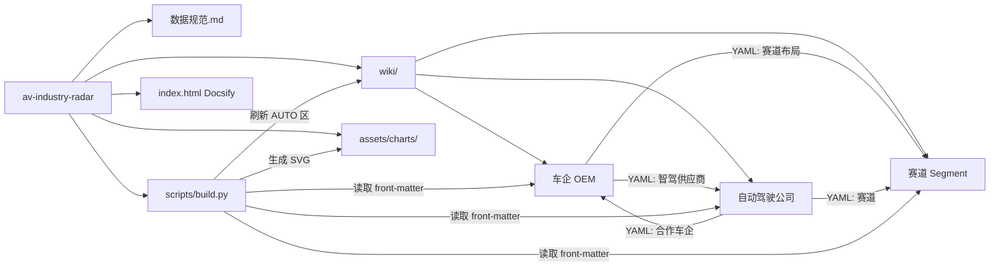

# av-industry-radar

轻量级、可演进的自动驾驶行业调研知识库。仓库只使用 Markdown + Mermaid 作为展示层，Python3 脚本负责自动刷新索引表与定量 SVG 图表；不引入数据库、不引入前端框架。

## 全景导航



## 仓库结构

```text
.
├── README.md
├── 数据规范.md
├── wiki/
│   ├── oems/
│   ├── ad-companies/
│   └── segments/
├── scripts/
│   ├── build.py
│   └── requirements.txt
├── assets/
│   ├── charts/
│   └── logos/oems/
├── index.html
└── _sidebar.md
```

## 使用方法

建议使用 Python 3.8+；`matplotlib>=3.7` 不支持更早的 Python 版本。

```bash
pip install -r scripts/requirements.txt
python scripts/build.py
```

运行后脚本会：

- 遍历 `wiki/{oems,ad-companies,segments}/*.md` 中的实体页；
- 解析 YAML front-matter，刷新各目录 README 的 `AUTO` 表格区；
- 读取带单位后缀的定量字段，生成 `assets/charts/*.svg`；
- 对缺失、`~` 或无法解析为数值的字段自动跳过。

可选本地站点：直接打开 `index.html`，或通过任意静态文件服务器托管仓库根目录。GitHub 原生页面也可以直接渲染 Markdown 与 Mermaid。

## 当前覆盖

| 类别 | 数量 | 入口 |
| --- | ---: | --- |
| 车企 OEM | 39 | [wiki/oems/README.md](wiki/oems/README.md) |
| 自动驾驶公司 | 71 | [wiki/ad-companies/README.md](wiki/ad-companies/README.md) |
| 自动驾驶赛道 | 7 | [wiki/segments/README.md](wiki/segments/README.md) |

覆盖对象包括主流中国/海外车企、新势力、传统 Tier1、芯片、传感器、Robotaxi、Robotruck、末端配送、港口、矿区和仿真验证工具链公司。长尾公司可继续按模板追加；易变的财务、销量、估值和交付数字仍保持 `~`，等待逐条核实后再补。

## 分类入口

| 分类问题 | 入口 |
| --- | --- |
| 车企按梯队怎么看？ | [车企索引：第一梯队/第二梯队/第三梯队/第四梯队](wiki/oems/README.md) |
| 哪些是中系、德系、日系、韩系、美系？ | [车企按国家/车系分类](wiki/oems/README.md#按国家车系分类) |
| 哪些公司做 Robotaxi？ | [自动驾驶公司：Robotaxi 分类](wiki/ad-companies/README.md#Robotaxi) |
| 哪些公司做 Robotruck？ | [自动驾驶公司：Robotruck 分类](wiki/ad-companies/README.md#Robotruck) |
| 哪些公司是全栈/多赛道？ | [自动驾驶公司：全栈/多赛道](wiki/ad-companies/README.md#全栈多赛道) |
| 哪些公司做芯片、激光雷达、仿真验证？ | [自动驾驶公司：按赛道/业务类型分类](wiki/ad-companies/README.md#按赛道业务类型分类) |

## 图表约定

| 信息类型 | 推荐表达 | 维护位置 |
| --- | --- | --- |
| 分类/关系 | Mermaid `flowchart` / `mindmap` | 正文 |
| 时间线 | Mermaid `timeline` | 正文 |
| 路线图 | Mermaid `gantt` | 正文 |
| 竞争定位 | Mermaid `quadrantChart` | 正文 |
| 定量对比：销量/营收/算力/车队 | `scripts/build.py` 生成 SVG | YAML 数值字段 + `assets/charts/` |
| 车企车标 | 本地图片 + Markdown 表格内 `` | YAML `车标` 字段 + `assets/logos/oems/` |
| 配置参数：芯片/传感器/算力 | Markdown 表格 | 正文 |

## 数据纪律

1. 单一数据源是实体页 YAML front-matter；结构化数据只在 YAML 中维护，正文只写分析、解释和图表。
2. 关系不依赖数据库，通过 YAML 字段互相点名：车企的 `智驾供应商`、公司的 `合作车企`、二者的 `赛道` / `赛道布局`。
3. 字段名使用中文；定量字段必须带单位后缀，例如 `年销量_万辆`、`营收_万元`、`最新估值_亿美元`。
4. 未核实数值一律填 `~`；财务和销量字段必须在 `来源` 中留下出处；每个实体必须有 `数据更新` 和 `状态`。
5. `状态` 用于过滤或标注已退出主体，常用值为：`活跃`、`已退出`、`已被收购`、`已上市`。

## 快速入口

- [数据规范](数据规范.md)
- [车企 OEM](wiki/oems/README.md)
- [自动驾驶公司](wiki/ad-companies/README.md)
- [赛道](wiki/segments/README.md)
