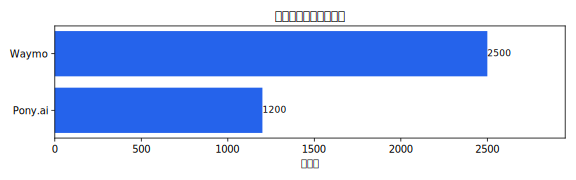
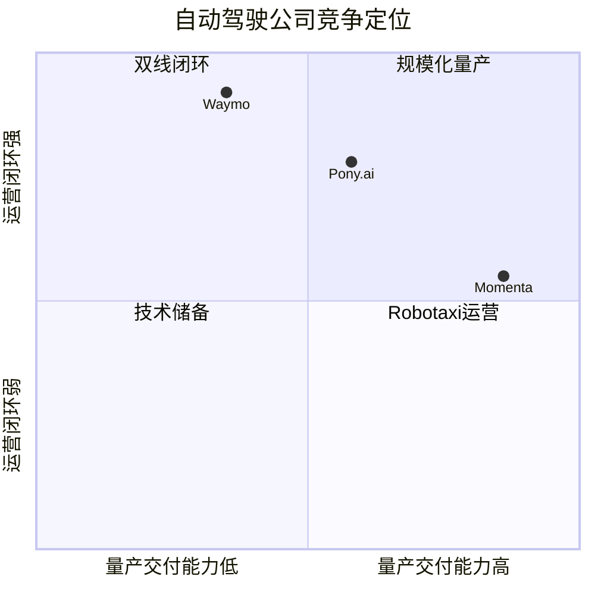

# 自动驾驶公司

自动驾驶公司页面覆盖 L4 运营商、量产方案商 Tier1、芯片、传感器和综合型公司。结构化字段只维护在各实体页 YAML front-matter 中。

## 公司索引

<!-- AUTO:START ad-companies-table -->
| 公司 | 类型 | 总部 | 主营业务 | 合作车企 | 状态 |
| --- | --- | --- | --- | --- | --- |
| [Ambarella](ambarella.md) | 芯片 | Santa Clara，美国 | 面向视觉感知、AI 处理和自动驾驶域控的低功耗 SoC | 车企/Tier1客户 | 已上市 |
| [Applied Intuition](applied-intuition.md) | 综合 | Mountain View，美国 | 提供自动驾驶仿真、验证、数据闭环和开发工具链 | 全球车企 / 自动驾驶公司 / 政府/国防客户 | 活跃 |
| [Aptiv](aptiv.md) | 量产方案商Tier1 | Dublin，爱尔兰 | 提供智能汽车电子架构、ADAS、软件和自动驾驶合资运营能力 | Hyundai / Motional / 全球车企客户 | 已上市 |
| [Argo AI](argo-ai.md) | L4运营商 | Pittsburgh，美国 | 曾面向自动驾驶出租车和货运场景开发 L4 自动驾驶系统 | Ford / Volkswagen | 已退出 |
| [Aurora](aurora.md) | L4运营商 | Pittsburgh，美国 | 面向干线物流的 Aurora Driver 自动驾驶卡车系统与商业货运网络 | PACCAR / Volvo / Uber Freight | 已上市 |
| [AutoX](autox.md) | L4运营商 | 深圳/圣何塞，中国/美国 | L4 Robotaxi 自动驾驶系统与无人化运营 | Stellantis / 上汽 / 东风 | 活跃 |
| [百度Apollo Go](baidu-apollo-go.md) | L4运营商 | 北京，中国 | 百度 Apollo 自动驾驶平台下的 Robotaxi 出行服务与自动驾驶开放能力 | 极狐 / 红旗 / 江铃 / 比亚迪 | 活跃 |
| [黑芝麻智能](black-sesame.md) | 芯片 | 武汉/上海，中国 | 车规级自动驾驶计算芯片、算法工具链和智能汽车计算平台 | 一汽 / 东风 / 江汽 / 车企/Tier1客户 | 已上市 |
| [博世](bosch.md) | 量产方案商Tier1 | Stuttgart，德国 | 面向全球车企提供 ADAS、制动、转向、域控、传感器和软件集成能力 | Volkswagen / Mercedes-Benz / BMW / 中国/欧洲车企客户 | 活跃 |
| [BOT Auto](bot-auto.md) | L4运营商 | Houston，美国 | 面向自动驾驶卡车货运的 L4 技术与运营公司 | 物流客户 | 活跃 |
| [Cartken](cartken.md) | L4运营商 | Oakland，美国 | 面向校园、商圈和企业场景的低速自动配送机器人 | ~ | 活跃 |
| [Caterpillar](caterpillar.md) | 综合 | Irving，美国 | 工程机械与矿山无人运输系统，代表产品为 Cat MineStar Command | 自研矿卡 / 矿山客户 | 已上市 |
| [大陆集团](continental.md) | 量产方案商Tier1 | Hanover，德国 | 提供车载摄像头、雷达、制动、安全系统和 ADAS 集成方案 | 全球车企客户 | 已上市 |
| [Cruise](cruise.md) | L4运营商 | San Francisco，美国 | 曾面向 Robotaxi 的 L4 自动驾驶系统与自运营出行服务 | General Motors / Honda | 已退出 |
| [元戎启行](deeproute.md) | 量产方案商Tier1 | 深圳，中国 | 面向车企量产的高阶智能驾驶方案和 L4 自动驾驶技术平台 | 长城 / smart / 车企客户 | 活跃 |
| [大疆车载](dji-automotive.md) | 量产方案商Tier1 | 深圳，中国 | 面向量产乘用车的智能驾驶软硬件系统和视觉感知方案 | 上汽通用五菱 / 大众 / 奇瑞 / 东风 | 活跃 |
| [dSPACE](dspace.md) | 综合 | Paderborn，德国 | 提供汽车电子开发、HIL/SIL、仿真验证和 ADAS 测试工具 | 全球车企 / Tier1客户 | 活跃 |
| [易控智驾](eacon.md) | L4运营商 | 北京，中国 | 矿区无人驾驶运输系统和新能源无人矿卡运营 | 矿山业主 / 矿卡厂商 | 活跃 |
| [EasyMile](easymile.md) | L4运营商 | Toulouse，法国 | 自动驾驶接驳车、园区车辆和工业场景无人运输方案 | ~ | 活跃 |
| [Einride](einride.md) | 综合 | Stockholm，瑞典 | 电动货运、远程驾驶和自动驾驶物流平台 | 物流客户 / 港口/园区客户 | 活跃 |
| [Embark Trucks](embark.md) | L4运营商 | San Francisco，美国 | 曾开发自动驾驶卡车软件平台，后被 Applied Intuition 收购 | 物流客户 | 已被收购 |
| [Fernride](fernride.md) | L4运营商 | Munich，德国 | 面向港口、堆场和物流园区的远程驾驶与自动化货运系统 | HHLA / Volkswagen / 物流/港口客户 | 活跃 |
| [Foretellix](foretellix.md) | 综合 | Tel Aviv，以色列 | 自动驾驶安全验证、场景生成、覆盖率分析和 V&V 工具平台 | Volvo / NVIDIA / 车企/Tier1客户 | 活跃 |
| [Gatik](gatik.md) | L4运营商 | Mountain View，美国 | 面向零售和物流客户的中短途 B2B 自动驾驶箱式货运服务 | Isuzu / Walmart / Kroger / Pitney Bowes | 活跃 |
| [毫末智行](haomo.md) | 量产方案商Tier1 | 北京，中国 | 源自长城体系的自动驾驶公司，提供乘用车辅助驾驶和末端物流相关技术 | 长城汽车 / 魏牌 / 坦克 / 车企客户 | 活跃 |
| [禾赛科技](hesai.md) | 传感器 | 上海，中国 | 车载激光雷达、Robotaxi/Robotruck 激光雷达和工业感知传感器 | 理想 / 长安 / 上汽 / Robotaxi客户 | 已上市 |
| [地平线机器人](horizon-robotics.md) | 芯片 | 北京，中国 | 征程系列车载智能计算芯片、开发工具链和智驾解决方案 | 比亚迪 / 理想 / 长安 / 上汽 / 大众集团 | 已上市 |
| [华为乾崑智驾](huawei-qiankun.md) | 量产方案商Tier1 | 深圳，中国 | 面向车企的智能驾驶系统、智能座舱和车云协同解决方案 | 赛力斯 / 阿维塔 / 北汽 / 奇瑞 / 江淮 / 长安 | 活跃 |
| [赢彻科技](inceptio.md) | 量产方案商Tier1 | 上海，中国 | 干线物流自动驾驶卡车系统、前装量产和运力运营 | 中国重汽 / 东风商用车 / 福田戴姆勒 | 活跃 |
| [Innoviz](innoviz.md) | 传感器 | Rosh HaAyin，以色列 | 车规激光雷达与感知软件供应商 | BMW / Volkswagen Group / 车企/Tier1客户 | 已上市 |
| [九识智能](jiushi.md) | L4运营商 | 苏州，中国 | 面向快递、零售和城市配送场景的无人配送车和自动驾驶运营平台 | 快递/零售/物流客户 | 活跃 |
| [Kodiak Robotics](kodiak.md) | L4运营商 | Mountain View，美国 | 面向长途货运和国防物流的自动驾驶卡车系统 | 物流车队 / 国防客户 | 活跃 |
| [Luminar](luminar.md) | 传感器 | Orlando，美国 | 面向乘用车和商用车的车规激光雷达与感知软件 | Volvo / Mercedes-Benz / Polestar / Nissan | 已上市 |
| [麦格纳](magna.md) | 量产方案商Tier1 | Aurora，加拿大 | 提供整车工程、ADAS、摄像头、雷达和智能驾驶系统集成能力 | 全球车企客户 | 已上市 |
| [智驾科技MAXIEYE](maxieye.md) | 量产方案商Tier1 | 上海，中国 | 提供乘用车和商用车 ADAS、行泊一体和智能驾驶解决方案 | 商用车/乘用车客户 | 活跃 |
| [May Mobility](may-mobility.md) | L4运营商 | Ann Arbor，美国 | 面向公共交通、园区和固定路线接驳的自动驾驶车辆服务 | Toyota / Via / 公共交通机构 | 活跃 |
| [佑驾创新](minieye.md) | 量产方案商Tier1 | 深圳，中国 | 提供 ADAS、智能驾驶、座舱感知和车路协同相关产品 | 中国车企/Tier1客户 | 活跃 |
| [Mobileye](mobileye.md) | 芯片 | Jerusalem，以色列 | EyeQ 芯片、SuperVision 高阶辅助驾驶、Chauffeur 自动驾驶方案和 REM 地图 | Zeekr / BMW / Volkswagen / Porsche / Polestar | 已上市 |
| [蘑菇车联](mogo-auto.md) | 综合 | 北京，中国 | 自动驾驶、车路云一体化和城市级智能交通解决方案 | 地方政府 / 公交/园区运营方 / 车企客户 | 活跃 |
| [Momenta](momenta.md) | 量产方案商Tier1 | 苏州，中国 | 数据飞轮驱动的量产辅助驾驶与 L4 自动驾驶方案 | 上汽 / 比亚迪 / 通用 / 丰田 / 奔驰 | 活跃 |
| [Motional](motional.md) | L4运营商 | Boston，美国 | 现代汽车与 Aptiv 合资的 L4 Robotaxi 技术与车辆平台 | 现代 / Aptiv | 活跃 |
| [新石器](neolix.md) | L4运营商 | 北京，中国 | 低速无人配送车、移动零售车和场景化无人车运营 | ~ | 活跃 |
| [Nullmax](nullmax.md) | 量产方案商Tier1 | 上海，中国 | 面向量产乘用车的智能驾驶算法、域控和低成本高阶辅助驾驶方案 | 中国车企客户 | 活跃 |
| [Nuro](nuro.md) | L4运营商 | Mountain View，美国 | 面向本地商业和配送场景的低速无人配送车辆与自动驾驶平台 | BYD / Uber Eats / Kroger | 活跃 |
| [NVIDIA DRIVE](nvidia-drive.md) | 芯片 | Santa Clara，美国 | 自动驾驶计算平台、车载 SoC、仿真和训练基础设施 | Mercedes-Benz / Volvo / BYD / Jaguar Land Rover / Lucid | 已上市 |
| [Ouster](ouster.md) | 传感器 | San Francisco，美国 | 数字激光雷达和感知解决方案，覆盖自动驾驶、工业和智慧基础设施 | 自动驾驶公司 / 工业/机器人客户 | 已上市 |
| [Outrider](outrider.md) | L4运营商 | Golden，美国 | 面向物流场站和配送中心的自动驾驶 Yard Truck 与场站自动化系统 | 物流场站客户 | 活跃 |
| [鉴智机器人](phigent-robotics.md) | 量产方案商Tier1 | 北京/上海，中国 | 以视觉 3D 感知和 BEV 感知算法为核心，提供量产智能驾驶方案 | 中国车企客户 | 活跃 |
| [PlusAI](plusai.md) | 量产方案商Tier1 | Santa Clara，美国 | 自动驾驶卡车与商用车高阶辅助驾驶系统 | IVECO / TRATON / Hyundai | 活跃 |
| [小马智行](pony.md) | L4运营商 | 广州/弗里蒙特，中国/美国 | Robotaxi 与小马智卡双线 L4 自动驾驶运营和技术服务 | 丰田 / 广汽 / 北汽 | 已上市 |
| [轻舟智航](qcraft.md) | 综合 | 苏州/北京，中国 | 高阶辅助驾驶方案、无人小巴和 L4 技术平台 | 车企客户 / 公交/园区运营方 | 活跃 |
| [Qualcomm Snapdragon Ride](qualcomm-snapdragon-ride.md) | 芯片 | San Diego，美国 | Snapdragon Ride 车载智驾平台和座舱/智驾融合计算平台 | BMW / GM / Stellantis / 长城 | 已上市 |
| [瑞萨电子](renesas.md) | 芯片 | Tokyo，日本 | 汽车 MCU、SoC、模拟电源和 ADAS 计算平台供应商 | 全球车企/Tier1客户 | 已上市 |
| [速腾聚创](robosense.md) | 传感器 | 深圳，中国 | 车载激光雷达、感知软件和机器人视觉方案 | 小鹏 / 广汽 / 极氪 / 车企客户 | 已上市 |
| [芯驰科技](semidrive.md) | 芯片 | 南京/上海，中国 | 车规 MCU、座舱、网关和智能驾驶芯片平台 | 中国车企/Tier1客户 | 活跃 |
| [Starship Technologies](starship.md) | L4运营商 | San Francisco/爱沙尼亚，美国/爱沙尼亚 | 校园、社区和商业区低速人行道配送机器人 | ~ | 活跃 |
| [踏歌智行](tage-idriver.md) | L4运营商 | 北京，中国 | 矿区无人驾驶运输系统、无人矿卡和矿山调度平台 | 矿山业主 / 工程车辆伙伴 | 活跃 |
| [特斯拉](tesla.md) | 综合 | Austin，美国 | 电动车、FSD 辅助驾驶软件和 Robotaxi/Cybercab 自动驾驶出行规划 | 自研 | 已上市 |
| [Torc Robotics](torc-robotics.md) | L4运营商 | Blacksburg，美国 | 戴姆勒卡车旗下自动驾驶卡车公司，面向干线物流开发 L4 卡车系统 | Daimler Truck / Freightliner | 活跃 |
| [图森未来](tusimple.md) | L4运营商 | San Diego/中国 | 曾面向干线物流开发 L4 自动驾驶卡车系统，后退出自动驾驶货运主线 | Navistar / UPS / 中国/美国物流客户 | 已退出 |
| [Uber ATG](uber-atg.md) | L4运营商 | Pittsburgh，美国 | Uber 曾经的自动驾驶研发部门，后并入 Aurora | Uber / Volvo / Aurora | 已被收购 |
| [驭势科技](uisee.md) | 综合 | 北京，中国 | 面向机场、厂区、物流和出行场景提供 L4 自动驾驶系统和运营服务 | 机场/物流/主机厂客户 | 活跃 |
| [法雷奥](valeo.md) | 量产方案商Tier1 | Paris，法国 | 提供 ADAS、激光雷达、摄像头、雷达和泊车辅助系统 | Mercedes-Benz / Stellantis / Renault / 全球车企客户 | 已上市 |
| [Waabi](waabi.md) | L4运营商 | Toronto，加拿大 | AI-first 自动驾驶卡车系统与仿真训练平台 | Volvo / Uber Freight | 活跃 |
| [Waymo](waymo.md) | L4运营商 | Mountain View，美国 | 自运营 Robotaxi 服务与软硬一体 Waymo Driver | Jaguar / Zeekr / 现代 | 活跃 |
| [Wayve](wayve.md) | 综合 | London，英国 | 以端到端具身智能路线开发自动驾驶基础模型和车辆智能系统 | Nissan / Microsoft / 车企客户 | 活跃 |
| [文远知行](weride.md) | 综合 | 广州，中国 | L4 自动驾驶平台，覆盖 Robotaxi、Robobus、Robovan、无人清扫和货运场景 | 日产 / 宇通 / 江铃 / 博世 | 已上市 |
| [西井科技](westwell.md) | 综合 | 上海，中国 | 港口与物流场景的无人驾驶商用车、智能港口系统和新能源物流装备 | 港口运营方 / 物流客户 | 活跃 |
| [白犀牛](whiterhino.md) | L4运营商 | 北京，中国 | 面向商超、社区和即时零售场景的无人配送车与运营服务 | 商超/零售/即时配送客户 | 活跃 |
| [采埃孚](zf.md) | 量产方案商Tier1 | Friedrichshafen，德国 | 提供 ADAS、域控制器、底盘执行器和自动驾驶商用车相关系统 | 全球车企客户 | 活跃 |
| [Zoox](zoox.md) | L4运营商 | Foster City，美国 | 面向 Robotaxi 的专用双向自动驾驶车辆和出行服务 | 自研车辆平台 / Amazon | 已被收购 |
<!-- AUTO:END ad-companies-table -->

## 按赛道/业务类型分类

分类由 YAML 字段 `赛道` 和 `类型` 自动推导。多赛道公司会出现在多个分类中；`全栈/多赛道` 用于标记覆盖 Robotaxi、Robotruck、量产辅助驾驶、Robobus/Robovan、配送、港口、矿区等多个方向的公司。

<!-- AUTO:START ad-companies-category-table -->
### Robotaxi

| 公司 | 类型 | 总部 | 赛道 | 主营业务 | 合作车企 | 状态 |
| --- | --- | --- | --- | --- | --- | --- |
| [百度Apollo Go](baidu-apollo-go.md) | L4运营商 | 北京，中国 | Robotaxi / Robobus/Robovan | 百度 Apollo 自动驾驶平台下的 Robotaxi 出行服务与自动驾驶开放能力 | 极狐 / 红旗 / 江铃 / 比亚迪 | 活跃 |
| [Aptiv](aptiv.md) | 量产方案商Tier1 | Dublin，爱尔兰 | 量产辅助驾驶 / Robotaxi | 提供智能汽车电子架构、ADAS、软件和自动驾驶合资运营能力 | Hyundai / Motional / 全球车企客户 | 已上市 |
| [Argo AI](argo-ai.md) | L4运营商 | Pittsburgh，美国 | Robotaxi / Robotruck | 曾面向自动驾驶出租车和货运场景开发 L4 自动驾驶系统 | Ford / Volkswagen | 已退出 |
| [AutoX](autox.md) | L4运营商 | 深圳/圣何塞，中国/美国 | Robotaxi | L4 Robotaxi 自动驾驶系统与无人化运营 | Stellantis / 上汽 / 东风 | 活跃 |
| [Cruise](cruise.md) | L4运营商 | San Francisco，美国 | Robotaxi | 曾面向 Robotaxi 的 L4 自动驾驶系统与自运营出行服务 | General Motors / Honda | 已退出 |
| [元戎启行](deeproute.md) | 量产方案商Tier1 | 深圳，中国 | 量产辅助驾驶 / Robotaxi | 面向车企量产的高阶智能驾驶方案和 L4 自动驾驶技术平台 | 长城 / smart / 车企客户 | 活跃 |
| [禾赛科技](hesai.md) | 传感器 | 上海，中国 | 量产辅助驾驶 / Robotaxi / Robotruck | 车载激光雷达、Robotaxi/Robotruck 激光雷达和工业感知传感器 | 理想 / 长安 / 上汽 / Robotaxi客户 | 已上市 |
| [Luminar](luminar.md) | 传感器 | Orlando，美国 | 量产辅助驾驶 / Robotaxi | 面向乘用车和商用车的车规激光雷达与感知软件 | Volvo / Mercedes-Benz / Polestar / Nissan | 已上市 |
| [Mobileye](mobileye.md) | 芯片 | Jerusalem，以色列 | 量产辅助驾驶 / Robotaxi | EyeQ 芯片、SuperVision 高阶辅助驾驶、Chauffeur 自动驾驶方案和 REM 地图 | Zeekr / BMW / Volkswagen / Porsche / Polestar | 已上市 |
| [Momenta](momenta.md) | 量产方案商Tier1 | 苏州，中国 | 量产辅助驾驶 / Robotaxi | 数据飞轮驱动的量产辅助驾驶与 L4 自动驾驶方案 | 上汽 / 比亚迪 / 通用 / 丰田 / 奔驰 | 活跃 |
| [Motional](motional.md) | L4运营商 | Boston，美国 | Robotaxi | 现代汽车与 Aptiv 合资的 L4 Robotaxi 技术与车辆平台 | 现代 / Aptiv | 活跃 |
| [NVIDIA DRIVE](nvidia-drive.md) | 芯片 | Santa Clara，美国 | 量产辅助驾驶 / Robotaxi / Robotruck | 自动驾驶计算平台、车载 SoC、仿真和训练基础设施 | Mercedes-Benz / Volvo / BYD / Jaguar Land Rover / Lucid | 已上市 |
| [Ouster](ouster.md) | 传感器 | San Francisco，美国 | Robotaxi / Robotruck / 港口 / 矿区 | 数字激光雷达和感知解决方案，覆盖自动驾驶、工业和智慧基础设施 | 自动驾驶公司 / 工业/机器人客户 | 已上市 |
| [小马智行](pony.md) | L4运营商 | 广州/弗里蒙特，中国/美国 | Robotaxi / Robotruck | Robotaxi 与小马智卡双线 L4 自动驾驶运营和技术服务 | 丰田 / 广汽 / 北汽 | 已上市 |
| [轻舟智航](qcraft.md) | 综合 | 苏州/北京，中国 | 量产辅助驾驶 / Robobus/Robovan / Robotaxi | 高阶辅助驾驶方案、无人小巴和 L4 技术平台 | 车企客户 / 公交/园区运营方 | 活跃 |
| [速腾聚创](robosense.md) | 传感器 | 深圳，中国 | 量产辅助驾驶 / Robotaxi / Robotruck | 车载激光雷达、感知软件和机器人视觉方案 | 小鹏 / 广汽 / 极氪 / 车企客户 | 已上市 |
| [特斯拉](tesla.md) | 综合 | Austin，美国 | 量产辅助驾驶 / Robotaxi | 电动车、FSD 辅助驾驶软件和 Robotaxi/Cybercab 自动驾驶出行规划 | 自研 | 已上市 |
| [Uber ATG](uber-atg.md) | L4运营商 | Pittsburgh，美国 | Robotaxi / Robotruck | Uber 曾经的自动驾驶研发部门，后并入 Aurora | Uber / Volvo / Aurora | 已被收购 |
| [Waymo](waymo.md) | L4运营商 | Mountain View，美国 | Robotaxi | 自运营 Robotaxi 服务与软硬一体 Waymo Driver | Jaguar / Zeekr / 现代 | 活跃 |
| [Wayve](wayve.md) | 综合 | London，英国 | 量产辅助驾驶 / Robotaxi | 以端到端具身智能路线开发自动驾驶基础模型和车辆智能系统 | Nissan / Microsoft / 车企客户 | 活跃 |
| [文远知行](weride.md) | 综合 | 广州，中国 | Robotaxi / Robobus/Robovan / 末端配送 / 港口 | L4 自动驾驶平台，覆盖 Robotaxi、Robobus、Robovan、无人清扫和货运场景 | 日产 / 宇通 / 江铃 / 博世 | 已上市 |
| [Zoox](zoox.md) | L4运营商 | Foster City，美国 | Robotaxi | 面向 Robotaxi 的专用双向自动驾驶车辆和出行服务 | 自研车辆平台 / Amazon | 已被收购 |

### Robotruck

| 公司 | 类型 | 总部 | 赛道 | 主营业务 | 合作车企 | 状态 |
| --- | --- | --- | --- | --- | --- | --- |
| [Applied Intuition](applied-intuition.md) | 综合 | Mountain View，美国 | 量产辅助驾驶 / Robotruck / 仿真工具 | 提供自动驾驶仿真、验证、数据闭环和开发工具链 | 全球车企 / 自动驾驶公司 / 政府/国防客户 | 活跃 |
| [Argo AI](argo-ai.md) | L4运营商 | Pittsburgh，美国 | Robotaxi / Robotruck | 曾面向自动驾驶出租车和货运场景开发 L4 自动驾驶系统 | Ford / Volkswagen | 已退出 |
| [Aurora](aurora.md) | L4运营商 | Pittsburgh，美国 | Robotruck | 面向干线物流的 Aurora Driver 自动驾驶卡车系统与商业货运网络 | PACCAR / Volvo / Uber Freight | 已上市 |
| [BOT Auto](bot-auto.md) | L4运营商 | Houston，美国 | Robotruck | 面向自动驾驶卡车货运的 L4 技术与运营公司 | 物流客户 | 活跃 |
| [Einride](einride.md) | 综合 | Stockholm，瑞典 | Robotruck / 港口 | 电动货运、远程驾驶和自动驾驶物流平台 | 物流客户 / 港口/园区客户 | 活跃 |
| [Embark Trucks](embark.md) | L4运营商 | San Francisco，美国 | Robotruck | 曾开发自动驾驶卡车软件平台，后被 Applied Intuition 收购 | 物流客户 | 已被收购 |
| [Fernride](fernride.md) | L4运营商 | Munich，德国 | 港口 / Robotruck | 面向港口、堆场和物流园区的远程驾驶与自动化货运系统 | HHLA / Volkswagen / 物流/港口客户 | 活跃 |
| [Gatik](gatik.md) | L4运营商 | Mountain View，美国 | Robotruck / 末端配送 | 面向零售和物流客户的中短途 B2B 自动驾驶箱式货运服务 | Isuzu / Walmart / Kroger / Pitney Bowes | 活跃 |
| [禾赛科技](hesai.md) | 传感器 | 上海，中国 | 量产辅助驾驶 / Robotaxi / Robotruck | 车载激光雷达、Robotaxi/Robotruck 激光雷达和工业感知传感器 | 理想 / 长安 / 上汽 / Robotaxi客户 | 已上市 |
| [赢彻科技](inceptio.md) | 量产方案商Tier1 | 上海，中国 | Robotruck / 量产辅助驾驶 | 干线物流自动驾驶卡车系统、前装量产和运力运营 | 中国重汽 / 东风商用车 / 福田戴姆勒 | 活跃 |
| [Kodiak Robotics](kodiak.md) | L4运营商 | Mountain View，美国 | Robotruck | 面向长途货运和国防物流的自动驾驶卡车系统 | 物流车队 / 国防客户 | 活跃 |
| [NVIDIA DRIVE](nvidia-drive.md) | 芯片 | Santa Clara，美国 | 量产辅助驾驶 / Robotaxi / Robotruck | 自动驾驶计算平台、车载 SoC、仿真和训练基础设施 | Mercedes-Benz / Volvo / BYD / Jaguar Land Rover / Lucid | 已上市 |
| [Ouster](ouster.md) | 传感器 | San Francisco，美国 | Robotaxi / Robotruck / 港口 / 矿区 | 数字激光雷达和感知解决方案，覆盖自动驾驶、工业和智慧基础设施 | 自动驾驶公司 / 工业/机器人客户 | 已上市 |
| [Outrider](outrider.md) | L4运营商 | Golden，美国 | Robotruck / 港口 | 面向物流场站和配送中心的自动驾驶 Yard Truck 与场站自动化系统 | 物流场站客户 | 活跃 |
| [PlusAI](plusai.md) | 量产方案商Tier1 | Santa Clara，美国 | Robotruck / 量产辅助驾驶 | 自动驾驶卡车与商用车高阶辅助驾驶系统 | IVECO / TRATON / Hyundai | 活跃 |
| [小马智行](pony.md) | L4运营商 | 广州/弗里蒙特，中国/美国 | Robotaxi / Robotruck | Robotaxi 与小马智卡双线 L4 自动驾驶运营和技术服务 | 丰田 / 广汽 / 北汽 | 已上市 |
| [速腾聚创](robosense.md) | 传感器 | 深圳，中国 | 量产辅助驾驶 / Robotaxi / Robotruck | 车载激光雷达、感知软件和机器人视觉方案 | 小鹏 / 广汽 / 极氪 / 车企客户 | 已上市 |
| [Torc Robotics](torc-robotics.md) | L4运营商 | Blacksburg，美国 | Robotruck | 戴姆勒卡车旗下自动驾驶卡车公司，面向干线物流开发 L4 卡车系统 | Daimler Truck / Freightliner | 活跃 |
| [图森未来](tusimple.md) | L4运营商 | San Diego/中国 | Robotruck | 曾面向干线物流开发 L4 自动驾驶卡车系统，后退出自动驾驶货运主线 | Navistar / UPS / 中国/美国物流客户 | 已退出 |
| [Uber ATG](uber-atg.md) | L4运营商 | Pittsburgh，美国 | Robotaxi / Robotruck | Uber 曾经的自动驾驶研发部门，后并入 Aurora | Uber / Volvo / Aurora | 已被收购 |
| [Waabi](waabi.md) | L4运营商 | Toronto，加拿大 | Robotruck | AI-first 自动驾驶卡车系统与仿真训练平台 | Volvo / Uber Freight | 活跃 |
| [西井科技](westwell.md) | 综合 | 上海，中国 | 港口 / Robotruck | 港口与物流场景的无人驾驶商用车、智能港口系统和新能源物流装备 | 港口运营方 / 物流客户 | 活跃 |

### 量产辅助驾驶

| 公司 | 类型 | 总部 | 赛道 | 主营业务 | 合作车企 | 状态 |
| --- | --- | --- | --- | --- | --- | --- |
| [Ambarella](ambarella.md) | 芯片 | Santa Clara，美国 | 量产辅助驾驶 | 面向视觉感知、AI 处理和自动驾驶域控的低功耗 SoC | 车企/Tier1客户 | 已上市 |
| [Applied Intuition](applied-intuition.md) | 综合 | Mountain View，美国 | 量产辅助驾驶 / Robotruck / 仿真工具 | 提供自动驾驶仿真、验证、数据闭环和开发工具链 | 全球车企 / 自动驾驶公司 / 政府/国防客户 | 活跃 |
| [Aptiv](aptiv.md) | 量产方案商Tier1 | Dublin，爱尔兰 | 量产辅助驾驶 / Robotaxi | 提供智能汽车电子架构、ADAS、软件和自动驾驶合资运营能力 | Hyundai / Motional / 全球车企客户 | 已上市 |
| [黑芝麻智能](black-sesame.md) | 芯片 | 武汉/上海，中国 | 量产辅助驾驶 | 车规级自动驾驶计算芯片、算法工具链和智能汽车计算平台 | 一汽 / 东风 / 江汽 / 车企/Tier1客户 | 已上市 |
| [博世](bosch.md) | 量产方案商Tier1 | Stuttgart，德国 | 量产辅助驾驶 | 面向全球车企提供 ADAS、制动、转向、域控、传感器和软件集成能力 | Volkswagen / Mercedes-Benz / BMW / 中国/欧洲车企客户 | 活跃 |
| [大陆集团](continental.md) | 量产方案商Tier1 | Hanover，德国 | 量产辅助驾驶 | 提供车载摄像头、雷达、制动、安全系统和 ADAS 集成方案 | 全球车企客户 | 已上市 |
| [大疆车载](dji-automotive.md) | 量产方案商Tier1 | 深圳，中国 | 量产辅助驾驶 | 面向量产乘用车的智能驾驶软硬件系统和视觉感知方案 | 上汽通用五菱 / 大众 / 奇瑞 / 东风 | 活跃 |
| [元戎启行](deeproute.md) | 量产方案商Tier1 | 深圳，中国 | 量产辅助驾驶 / Robotaxi | 面向车企量产的高阶智能驾驶方案和 L4 自动驾驶技术平台 | 长城 / smart / 车企客户 | 活跃 |
| [Foretellix](foretellix.md) | 综合 | Tel Aviv，以色列 | 量产辅助驾驶 / 仿真工具 | 自动驾驶安全验证、场景生成、覆盖率分析和 V&V 工具平台 | Volvo / NVIDIA / 车企/Tier1客户 | 活跃 |
| [毫末智行](haomo.md) | 量产方案商Tier1 | 北京，中国 | 量产辅助驾驶 | 源自长城体系的自动驾驶公司，提供乘用车辅助驾驶和末端物流相关技术 | 长城汽车 / 魏牌 / 坦克 / 车企客户 | 活跃 |
| [禾赛科技](hesai.md) | 传感器 | 上海，中国 | 量产辅助驾驶 / Robotaxi / Robotruck | 车载激光雷达、Robotaxi/Robotruck 激光雷达和工业感知传感器 | 理想 / 长安 / 上汽 / Robotaxi客户 | 已上市 |
| [地平线机器人](horizon-robotics.md) | 芯片 | 北京，中国 | 量产辅助驾驶 | 征程系列车载智能计算芯片、开发工具链和智驾解决方案 | 比亚迪 / 理想 / 长安 / 上汽 / 大众集团 | 已上市 |
| [华为乾崑智驾](huawei-qiankun.md) | 量产方案商Tier1 | 深圳，中国 | 量产辅助驾驶 | 面向车企的智能驾驶系统、智能座舱和车云协同解决方案 | 赛力斯 / 阿维塔 / 北汽 / 奇瑞 / 江淮 / 长安 | 活跃 |
| [赢彻科技](inceptio.md) | 量产方案商Tier1 | 上海，中国 | Robotruck / 量产辅助驾驶 | 干线物流自动驾驶卡车系统、前装量产和运力运营 | 中国重汽 / 东风商用车 / 福田戴姆勒 | 活跃 |
| [Innoviz](innoviz.md) | 传感器 | Rosh HaAyin，以色列 | 量产辅助驾驶 | 车规激光雷达与感知软件供应商 | BMW / Volkswagen Group / 车企/Tier1客户 | 已上市 |
| [Luminar](luminar.md) | 传感器 | Orlando，美国 | 量产辅助驾驶 / Robotaxi | 面向乘用车和商用车的车规激光雷达与感知软件 | Volvo / Mercedes-Benz / Polestar / Nissan | 已上市 |
| [智驾科技MAXIEYE](maxieye.md) | 量产方案商Tier1 | 上海，中国 | 量产辅助驾驶 | 提供乘用车和商用车 ADAS、行泊一体和智能驾驶解决方案 | 商用车/乘用车客户 | 活跃 |
| [佑驾创新](minieye.md) | 量产方案商Tier1 | 深圳，中国 | 量产辅助驾驶 | 提供 ADAS、智能驾驶、座舱感知和车路协同相关产品 | 中国车企/Tier1客户 | 活跃 |
| [麦格纳](magna.md) | 量产方案商Tier1 | Aurora，加拿大 | 量产辅助驾驶 | 提供整车工程、ADAS、摄像头、雷达和智能驾驶系统集成能力 | 全球车企客户 | 已上市 |
| [Mobileye](mobileye.md) | 芯片 | Jerusalem，以色列 | 量产辅助驾驶 / Robotaxi | EyeQ 芯片、SuperVision 高阶辅助驾驶、Chauffeur 自动驾驶方案和 REM 地图 | Zeekr / BMW / Volkswagen / Porsche / Polestar | 已上市 |
| [蘑菇车联](mogo-auto.md) | 综合 | 北京，中国 | Robobus/Robovan / 量产辅助驾驶 / 车路协同 | 自动驾驶、车路云一体化和城市级智能交通解决方案 | 地方政府 / 公交/园区运营方 / 车企客户 | 活跃 |
| [Momenta](momenta.md) | 量产方案商Tier1 | 苏州，中国 | 量产辅助驾驶 / Robotaxi | 数据飞轮驱动的量产辅助驾驶与 L4 自动驾驶方案 | 上汽 / 比亚迪 / 通用 / 丰田 / 奔驰 | 活跃 |
| [NVIDIA DRIVE](nvidia-drive.md) | 芯片 | Santa Clara，美国 | 量产辅助驾驶 / Robotaxi / Robotruck | 自动驾驶计算平台、车载 SoC、仿真和训练基础设施 | Mercedes-Benz / Volvo / BYD / Jaguar Land Rover / Lucid | 已上市 |
| [Nullmax](nullmax.md) | 量产方案商Tier1 | 上海，中国 | 量产辅助驾驶 | 面向量产乘用车的智能驾驶算法、域控和低成本高阶辅助驾驶方案 | 中国车企客户 | 活跃 |
| [鉴智机器人](phigent-robotics.md) | 量产方案商Tier1 | 北京/上海，中国 | 量产辅助驾驶 | 以视觉 3D 感知和 BEV 感知算法为核心，提供量产智能驾驶方案 | 中国车企客户 | 活跃 |
| [PlusAI](plusai.md) | 量产方案商Tier1 | Santa Clara，美国 | Robotruck / 量产辅助驾驶 | 自动驾驶卡车与商用车高阶辅助驾驶系统 | IVECO / TRATON / Hyundai | 活跃 |
| [轻舟智航](qcraft.md) | 综合 | 苏州/北京，中国 | 量产辅助驾驶 / Robobus/Robovan / Robotaxi | 高阶辅助驾驶方案、无人小巴和 L4 技术平台 | 车企客户 / 公交/园区运营方 | 活跃 |
| [瑞萨电子](renesas.md) | 芯片 | Tokyo，日本 | 量产辅助驾驶 | 汽车 MCU、SoC、模拟电源和 ADAS 计算平台供应商 | 全球车企/Tier1客户 | 已上市 |
| [速腾聚创](robosense.md) | 传感器 | 深圳，中国 | 量产辅助驾驶 / Robotaxi / Robotruck | 车载激光雷达、感知软件和机器人视觉方案 | 小鹏 / 广汽 / 极氪 / 车企客户 | 已上市 |
| [芯驰科技](semidrive.md) | 芯片 | 南京/上海，中国 | 量产辅助驾驶 | 车规 MCU、座舱、网关和智能驾驶芯片平台 | 中国车企/Tier1客户 | 活跃 |
| [Qualcomm Snapdragon Ride](qualcomm-snapdragon-ride.md) | 芯片 | San Diego，美国 | 量产辅助驾驶 | Snapdragon Ride 车载智驾平台和座舱/智驾融合计算平台 | BMW / GM / Stellantis / 长城 | 已上市 |
| [特斯拉](tesla.md) | 综合 | Austin，美国 | 量产辅助驾驶 / Robotaxi | 电动车、FSD 辅助驾驶软件和 Robotaxi/Cybercab 自动驾驶出行规划 | 自研 | 已上市 |
| [驭势科技](uisee.md) | 综合 | 北京，中国 | Robobus/Robovan / 港口 / 机场 / 量产辅助驾驶 | 面向机场、厂区、物流和出行场景提供 L4 自动驾驶系统和运营服务 | 机场/物流/主机厂客户 | 活跃 |
| [法雷奥](valeo.md) | 量产方案商Tier1 | Paris，法国 | 量产辅助驾驶 / 传感器 | 提供 ADAS、激光雷达、摄像头、雷达和泊车辅助系统 | Mercedes-Benz / Stellantis / Renault / 全球车企客户 | 已上市 |
| [Wayve](wayve.md) | 综合 | London，英国 | 量产辅助驾驶 / Robotaxi | 以端到端具身智能路线开发自动驾驶基础模型和车辆智能系统 | Nissan / Microsoft / 车企客户 | 活跃 |
| [采埃孚](zf.md) | 量产方案商Tier1 | Friedrichshafen，德国 | 量产辅助驾驶 | 提供 ADAS、域控制器、底盘执行器和自动驾驶商用车相关系统 | 全球车企客户 | 活跃 |
| [dSPACE](dspace.md) | 综合 | Paderborn，德国 | 量产辅助驾驶 / 仿真工具 | 提供汽车电子开发、HIL/SIL、仿真验证和 ADAS 测试工具 | 全球车企 / Tier1客户 | 活跃 |

### Robobus/Robovan

| 公司 | 类型 | 总部 | 赛道 | 主营业务 | 合作车企 | 状态 |
| --- | --- | --- | --- | --- | --- | --- |
| [百度Apollo Go](baidu-apollo-go.md) | L4运营商 | 北京，中国 | Robotaxi / Robobus/Robovan | 百度 Apollo 自动驾驶平台下的 Robotaxi 出行服务与自动驾驶开放能力 | 极狐 / 红旗 / 江铃 / 比亚迪 | 活跃 |
| [EasyMile](easymile.md) | L4运营商 | Toulouse，法国 | Robobus/Robovan | 自动驾驶接驳车、园区车辆和工业场景无人运输方案 | ~ | 活跃 |
| [九识智能](jiushi.md) | L4运营商 | 苏州，中国 | 末端配送 / Robobus/Robovan | 面向快递、零售和城市配送场景的无人配送车和自动驾驶运营平台 | 快递/零售/物流客户 | 活跃 |
| [May Mobility](may-mobility.md) | L4运营商 | Ann Arbor，美国 | Robobus/Robovan | 面向公共交通、园区和固定路线接驳的自动驾驶车辆服务 | Toyota / Via / 公共交通机构 | 活跃 |
| [蘑菇车联](mogo-auto.md) | 综合 | 北京，中国 | Robobus/Robovan / 量产辅助驾驶 / 车路协同 | 自动驾驶、车路云一体化和城市级智能交通解决方案 | 地方政府 / 公交/园区运营方 / 车企客户 | 活跃 |
| [新石器](neolix.md) | L4运营商 | 北京，中国 | 末端配送 / Robobus/Robovan | 低速无人配送车、移动零售车和场景化无人车运营 | ~ | 活跃 |
| [轻舟智航](qcraft.md) | 综合 | 苏州/北京，中国 | 量产辅助驾驶 / Robobus/Robovan / Robotaxi | 高阶辅助驾驶方案、无人小巴和 L4 技术平台 | 车企客户 / 公交/园区运营方 | 活跃 |
| [驭势科技](uisee.md) | 综合 | 北京，中国 | Robobus/Robovan / 港口 / 机场 / 量产辅助驾驶 | 面向机场、厂区、物流和出行场景提供 L4 自动驾驶系统和运营服务 | 机场/物流/主机厂客户 | 活跃 |
| [文远知行](weride.md) | 综合 | 广州，中国 | Robotaxi / Robobus/Robovan / 末端配送 / 港口 | L4 自动驾驶平台，覆盖 Robotaxi、Robobus、Robovan、无人清扫和货运场景 | 日产 / 宇通 / 江铃 / 博世 | 已上市 |

### 末端配送

| 公司 | 类型 | 总部 | 赛道 | 主营业务 | 合作车企 | 状态 |
| --- | --- | --- | --- | --- | --- | --- |
| [Cartken](cartken.md) | L4运营商 | Oakland，美国 | 末端配送 | 面向校园、商圈和企业场景的低速自动配送机器人 | ~ | 活跃 |
| [Gatik](gatik.md) | L4运营商 | Mountain View，美国 | Robotruck / 末端配送 | 面向零售和物流客户的中短途 B2B 自动驾驶箱式货运服务 | Isuzu / Walmart / Kroger / Pitney Bowes | 活跃 |
| [九识智能](jiushi.md) | L4运营商 | 苏州，中国 | 末端配送 / Robobus/Robovan | 面向快递、零售和城市配送场景的无人配送车和自动驾驶运营平台 | 快递/零售/物流客户 | 活跃 |
| [新石器](neolix.md) | L4运营商 | 北京，中国 | 末端配送 / Robobus/Robovan | 低速无人配送车、移动零售车和场景化无人车运营 | ~ | 活跃 |
| [Nuro](nuro.md) | L4运营商 | Mountain View，美国 | 末端配送 | 面向本地商业和配送场景的低速无人配送车辆与自动驾驶平台 | BYD / Uber Eats / Kroger | 活跃 |
| [Starship Technologies](starship.md) | L4运营商 | San Francisco/爱沙尼亚，美国/爱沙尼亚 | 末端配送 | 校园、社区和商业区低速人行道配送机器人 | ~ | 活跃 |
| [文远知行](weride.md) | 综合 | 广州，中国 | Robotaxi / Robobus/Robovan / 末端配送 / 港口 | L4 自动驾驶平台，覆盖 Robotaxi、Robobus、Robovan、无人清扫和货运场景 | 日产 / 宇通 / 江铃 / 博世 | 已上市 |
| [白犀牛](whiterhino.md) | L4运营商 | 北京，中国 | 末端配送 | 面向商超、社区和即时零售场景的无人配送车与运营服务 | 商超/零售/即时配送客户 | 活跃 |

### 港口

| 公司 | 类型 | 总部 | 赛道 | 主营业务 | 合作车企 | 状态 |
| --- | --- | --- | --- | --- | --- | --- |
| [Einride](einride.md) | 综合 | Stockholm，瑞典 | Robotruck / 港口 | 电动货运、远程驾驶和自动驾驶物流平台 | 物流客户 / 港口/园区客户 | 活跃 |
| [Fernride](fernride.md) | L4运营商 | Munich，德国 | 港口 / Robotruck | 面向港口、堆场和物流园区的远程驾驶与自动化货运系统 | HHLA / Volkswagen / 物流/港口客户 | 活跃 |
| [Ouster](ouster.md) | 传感器 | San Francisco，美国 | Robotaxi / Robotruck / 港口 / 矿区 | 数字激光雷达和感知解决方案，覆盖自动驾驶、工业和智慧基础设施 | 自动驾驶公司 / 工业/机器人客户 | 已上市 |
| [Outrider](outrider.md) | L4运营商 | Golden，美国 | Robotruck / 港口 | 面向物流场站和配送中心的自动驾驶 Yard Truck 与场站自动化系统 | 物流场站客户 | 活跃 |
| [驭势科技](uisee.md) | 综合 | 北京，中国 | Robobus/Robovan / 港口 / 机场 / 量产辅助驾驶 | 面向机场、厂区、物流和出行场景提供 L4 自动驾驶系统和运营服务 | 机场/物流/主机厂客户 | 活跃 |
| [文远知行](weride.md) | 综合 | 广州，中国 | Robotaxi / Robobus/Robovan / 末端配送 / 港口 | L4 自动驾驶平台，覆盖 Robotaxi、Robobus、Robovan、无人清扫和货运场景 | 日产 / 宇通 / 江铃 / 博世 | 已上市 |
| [西井科技](westwell.md) | 综合 | 上海，中国 | 港口 / Robotruck | 港口与物流场景的无人驾驶商用车、智能港口系统和新能源物流装备 | 港口运营方 / 物流客户 | 活跃 |

### 矿区

| 公司 | 类型 | 总部 | 赛道 | 主营业务 | 合作车企 | 状态 |
| --- | --- | --- | --- | --- | --- | --- |
| [Caterpillar](caterpillar.md) | 综合 | Irving，美国 | 矿区 | 工程机械与矿山无人运输系统，代表产品为 Cat MineStar Command | 自研矿卡 / 矿山客户 | 已上市 |
| [易控智驾](eacon.md) | L4运营商 | 北京，中国 | 矿区 | 矿区无人驾驶运输系统和新能源无人矿卡运营 | 矿山业主 / 矿卡厂商 | 活跃 |
| [Ouster](ouster.md) | 传感器 | San Francisco，美国 | Robotaxi / Robotruck / 港口 / 矿区 | 数字激光雷达和感知解决方案，覆盖自动驾驶、工业和智慧基础设施 | 自动驾驶公司 / 工业/机器人客户 | 已上市 |
| [踏歌智行](tage-idriver.md) | L4运营商 | 北京，中国 | 矿区 | 矿区无人驾驶运输系统、无人矿卡和矿山调度平台 | 矿山业主 / 工程车辆伙伴 | 活跃 |

### 全栈/多赛道

| 公司 | 类型 | 总部 | 赛道 | 主营业务 | 合作车企 | 状态 |
| --- | --- | --- | --- | --- | --- | --- |
| [Applied Intuition](applied-intuition.md) | 综合 | Mountain View，美国 | 量产辅助驾驶 / Robotruck / 仿真工具 | 提供自动驾驶仿真、验证、数据闭环和开发工具链 | 全球车企 / 自动驾驶公司 / 政府/国防客户 | 活跃 |
| [Caterpillar](caterpillar.md) | 综合 | Irving，美国 | 矿区 | 工程机械与矿山无人运输系统，代表产品为 Cat MineStar Command | 自研矿卡 / 矿山客户 | 已上市 |
| [Einride](einride.md) | 综合 | Stockholm，瑞典 | Robotruck / 港口 | 电动货运、远程驾驶和自动驾驶物流平台 | 物流客户 / 港口/园区客户 | 活跃 |
| [Foretellix](foretellix.md) | 综合 | Tel Aviv，以色列 | 量产辅助驾驶 / 仿真工具 | 自动驾驶安全验证、场景生成、覆盖率分析和 V&V 工具平台 | Volvo / NVIDIA / 车企/Tier1客户 | 活跃 |
| [禾赛科技](hesai.md) | 传感器 | 上海，中国 | 量产辅助驾驶 / Robotaxi / Robotruck | 车载激光雷达、Robotaxi/Robotruck 激光雷达和工业感知传感器 | 理想 / 长安 / 上汽 / Robotaxi客户 | 已上市 |
| [蘑菇车联](mogo-auto.md) | 综合 | 北京，中国 | Robobus/Robovan / 量产辅助驾驶 / 车路协同 | 自动驾驶、车路云一体化和城市级智能交通解决方案 | 地方政府 / 公交/园区运营方 / 车企客户 | 活跃 |
| [NVIDIA DRIVE](nvidia-drive.md) | 芯片 | Santa Clara，美国 | 量产辅助驾驶 / Robotaxi / Robotruck | 自动驾驶计算平台、车载 SoC、仿真和训练基础设施 | Mercedes-Benz / Volvo / BYD / Jaguar Land Rover / Lucid | 已上市 |
| [Ouster](ouster.md) | 传感器 | San Francisco，美国 | Robotaxi / Robotruck / 港口 / 矿区 | 数字激光雷达和感知解决方案，覆盖自动驾驶、工业和智慧基础设施 | 自动驾驶公司 / 工业/机器人客户 | 已上市 |
| [轻舟智航](qcraft.md) | 综合 | 苏州/北京，中国 | 量产辅助驾驶 / Robobus/Robovan / Robotaxi | 高阶辅助驾驶方案、无人小巴和 L4 技术平台 | 车企客户 / 公交/园区运营方 | 活跃 |
| [速腾聚创](robosense.md) | 传感器 | 深圳，中国 | 量产辅助驾驶 / Robotaxi / Robotruck | 车载激光雷达、感知软件和机器人视觉方案 | 小鹏 / 广汽 / 极氪 / 车企客户 | 已上市 |
| [特斯拉](tesla.md) | 综合 | Austin，美国 | 量产辅助驾驶 / Robotaxi | 电动车、FSD 辅助驾驶软件和 Robotaxi/Cybercab 自动驾驶出行规划 | 自研 | 已上市 |
| [驭势科技](uisee.md) | 综合 | 北京，中国 | Robobus/Robovan / 港口 / 机场 / 量产辅助驾驶 | 面向机场、厂区、物流和出行场景提供 L4 自动驾驶系统和运营服务 | 机场/物流/主机厂客户 | 活跃 |
| [Wayve](wayve.md) | 综合 | London，英国 | 量产辅助驾驶 / Robotaxi | 以端到端具身智能路线开发自动驾驶基础模型和车辆智能系统 | Nissan / Microsoft / 车企客户 | 活跃 |
| [文远知行](weride.md) | 综合 | 广州，中国 | Robotaxi / Robobus/Robovan / 末端配送 / 港口 | L4 自动驾驶平台，覆盖 Robotaxi、Robobus、Robovan、无人清扫和货运场景 | 日产 / 宇通 / 江铃 / 博世 | 已上市 |
| [西井科技](westwell.md) | 综合 | 上海，中国 | 港口 / Robotruck | 港口与物流场景的无人驾驶商用车、智能港口系统和新能源物流装备 | 港口运营方 / 物流客户 | 活跃 |
| [dSPACE](dspace.md) | 综合 | Paderborn，德国 | 量产辅助驾驶 / 仿真工具 | 提供汽车电子开发、HIL/SIL、仿真验证和 ADAS 测试工具 | 全球车企 / Tier1客户 | 活跃 |

### 芯片/计算平台

| 公司 | 类型 | 总部 | 赛道 | 主营业务 | 合作车企 | 状态 |
| --- | --- | --- | --- | --- | --- | --- |
| [Ambarella](ambarella.md) | 芯片 | Santa Clara，美国 | 量产辅助驾驶 | 面向视觉感知、AI 处理和自动驾驶域控的低功耗 SoC | 车企/Tier1客户 | 已上市 |
| [黑芝麻智能](black-sesame.md) | 芯片 | 武汉/上海，中国 | 量产辅助驾驶 | 车规级自动驾驶计算芯片、算法工具链和智能汽车计算平台 | 一汽 / 东风 / 江汽 / 车企/Tier1客户 | 已上市 |
| [地平线机器人](horizon-robotics.md) | 芯片 | 北京，中国 | 量产辅助驾驶 | 征程系列车载智能计算芯片、开发工具链和智驾解决方案 | 比亚迪 / 理想 / 长安 / 上汽 / 大众集团 | 已上市 |
| [Mobileye](mobileye.md) | 芯片 | Jerusalem，以色列 | 量产辅助驾驶 / Robotaxi | EyeQ 芯片、SuperVision 高阶辅助驾驶、Chauffeur 自动驾驶方案和 REM 地图 | Zeekr / BMW / Volkswagen / Porsche / Polestar | 已上市 |
| [NVIDIA DRIVE](nvidia-drive.md) | 芯片 | Santa Clara，美国 | 量产辅助驾驶 / Robotaxi / Robotruck | 自动驾驶计算平台、车载 SoC、仿真和训练基础设施 | Mercedes-Benz / Volvo / BYD / Jaguar Land Rover / Lucid | 已上市 |
| [瑞萨电子](renesas.md) | 芯片 | Tokyo，日本 | 量产辅助驾驶 | 汽车 MCU、SoC、模拟电源和 ADAS 计算平台供应商 | 全球车企/Tier1客户 | 已上市 |
| [芯驰科技](semidrive.md) | 芯片 | 南京/上海，中国 | 量产辅助驾驶 | 车规 MCU、座舱、网关和智能驾驶芯片平台 | 中国车企/Tier1客户 | 活跃 |
| [Qualcomm Snapdragon Ride](qualcomm-snapdragon-ride.md) | 芯片 | San Diego，美国 | 量产辅助驾驶 | Snapdragon Ride 车载智驾平台和座舱/智驾融合计算平台 | BMW / GM / Stellantis / 长城 | 已上市 |

### 传感器/激光雷达

| 公司 | 类型 | 总部 | 赛道 | 主营业务 | 合作车企 | 状态 |
| --- | --- | --- | --- | --- | --- | --- |
| [禾赛科技](hesai.md) | 传感器 | 上海，中国 | 量产辅助驾驶 / Robotaxi / Robotruck | 车载激光雷达、Robotaxi/Robotruck 激光雷达和工业感知传感器 | 理想 / 长安 / 上汽 / Robotaxi客户 | 已上市 |
| [Innoviz](innoviz.md) | 传感器 | Rosh HaAyin，以色列 | 量产辅助驾驶 | 车规激光雷达与感知软件供应商 | BMW / Volkswagen Group / 车企/Tier1客户 | 已上市 |
| [Luminar](luminar.md) | 传感器 | Orlando，美国 | 量产辅助驾驶 / Robotaxi | 面向乘用车和商用车的车规激光雷达与感知软件 | Volvo / Mercedes-Benz / Polestar / Nissan | 已上市 |
| [Ouster](ouster.md) | 传感器 | San Francisco，美国 | Robotaxi / Robotruck / 港口 / 矿区 | 数字激光雷达和感知解决方案，覆盖自动驾驶、工业和智慧基础设施 | 自动驾驶公司 / 工业/机器人客户 | 已上市 |
| [速腾聚创](robosense.md) | 传感器 | 深圳，中国 | 量产辅助驾驶 / Robotaxi / Robotruck | 车载激光雷达、感知软件和机器人视觉方案 | 小鹏 / 广汽 / 极氪 / 车企客户 | 已上市 |

### 仿真/验证工具链

| 公司 | 类型 | 总部 | 赛道 | 主营业务 | 合作车企 | 状态 |
| --- | --- | --- | --- | --- | --- | --- |
| [Applied Intuition](applied-intuition.md) | 综合 | Mountain View，美国 | 量产辅助驾驶 / Robotruck / 仿真工具 | 提供自动驾驶仿真、验证、数据闭环和开发工具链 | 全球车企 / 自动驾驶公司 / 政府/国防客户 | 活跃 |
| [黑芝麻智能](black-sesame.md) | 芯片 | 武汉/上海，中国 | 量产辅助驾驶 | 车规级自动驾驶计算芯片、算法工具链和智能汽车计算平台 | 一汽 / 东风 / 江汽 / 车企/Tier1客户 | 已上市 |
| [Foretellix](foretellix.md) | 综合 | Tel Aviv，以色列 | 量产辅助驾驶 / 仿真工具 | 自动驾驶安全验证、场景生成、覆盖率分析和 V&V 工具平台 | Volvo / NVIDIA / 车企/Tier1客户 | 活跃 |
| [地平线机器人](horizon-robotics.md) | 芯片 | 北京，中国 | 量产辅助驾驶 | 征程系列车载智能计算芯片、开发工具链和智驾解决方案 | 比亚迪 / 理想 / 长安 / 上汽 / 大众集团 | 已上市 |
| [NVIDIA DRIVE](nvidia-drive.md) | 芯片 | Santa Clara，美国 | 量产辅助驾驶 / Robotaxi / Robotruck | 自动驾驶计算平台、车载 SoC、仿真和训练基础设施 | Mercedes-Benz / Volvo / BYD / Jaguar Land Rover / Lucid | 已上市 |
| [Waabi](waabi.md) | L4运营商 | Toronto，加拿大 | Robotruck | AI-first 自动驾驶卡车系统与仿真训练平台 | Volvo / Uber Freight | 活跃 |
| [dSPACE](dspace.md) | 综合 | Paderborn，德国 | 量产辅助驾驶 / 仿真工具 | 提供汽车电子开发、HIL/SIL、仿真验证和 ADAS 测试工具 | 全球车企 / Tier1客户 | 活跃 |
<!-- AUTO:END ad-companies-category-table -->

## 定量图表

当实体页存在可核实数值时，脚本会生成对应 SVG；全部为 `~` 时不生成。

## 竞争象限

