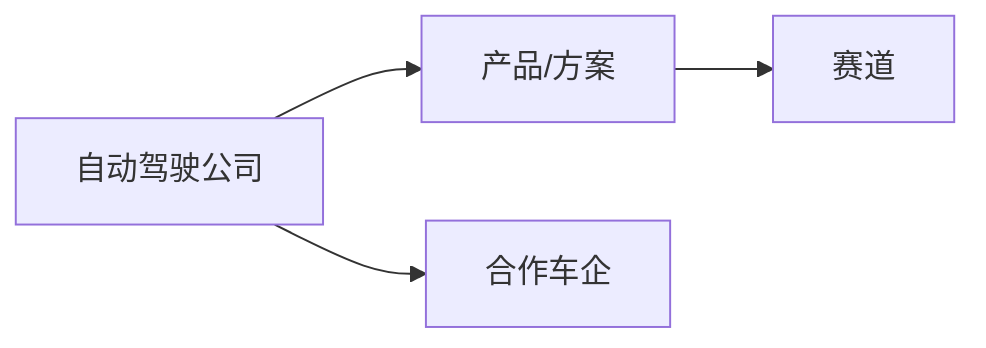
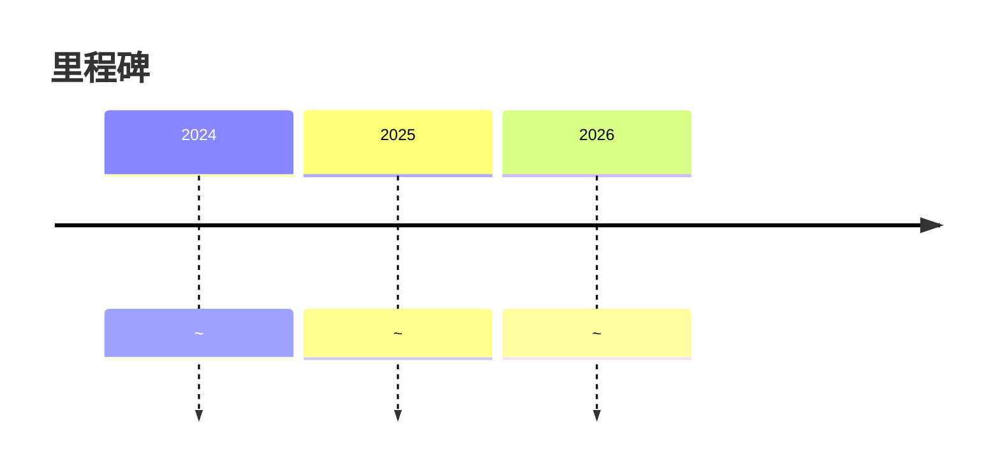

# 名称

## 定位/主营业务

填写公司定位、核心技术路线、商业化阶段和主要客户类型。

## 产品矩阵

| 产品 | 定位 | 芯片 | 算力TOPS | 传感器 | 交付形态 |
| --- | --- | --- | --- | --- | --- |
| ~ | ~ | ~ | ~ | ~ | ~ |

## 合作关系

```mermaid
flowchart LR
    Company["自动驾驶公司"] --> Product["产品/方案"]
    Company --> OEM["合作车企"]
    Product --> Segment["赛道"]
```

## 里程碑

```mermaid
timeline
    title 里程碑
    2024 : ~
    2025 : ~
    2026 : ~
```

## 一句话点评

~
