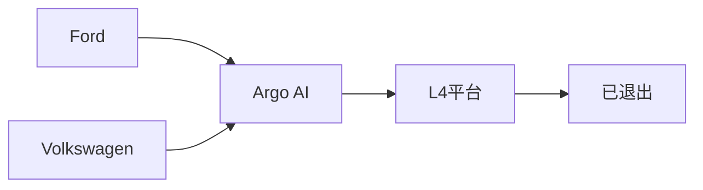
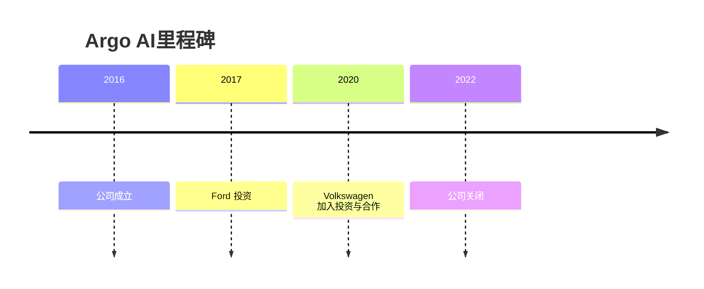

# Argo AI

## 定位/主营业务

Argo AI 曾由 Ford 和 Volkswagen 投资，定位 L4 自动驾驶平台。2022 年公司关闭，是 L4 赛道资本周期和商业化难度的早期标志性案例。

## 产品矩阵

| 产品 | 定位 | 芯片 | 算力TOPS | 传感器 | 交付形态 |
| --- | --- | --- | --- | --- | --- |
| Argo Autonomy Platform | L4 自动驾驶系统 | ~ | ~ | 多传感器融合 | 已退出 |

## 合作关系

## 里程碑

## 一句话点评

Argo AI 说明即便有大型车企背书，L4 仍必须找到足够短的商业闭环和可承受的资本投入曲线。
