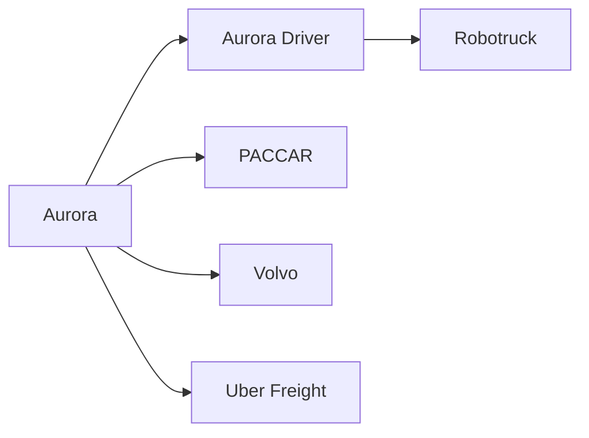
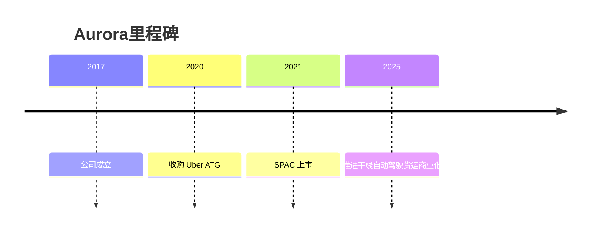

# Aurora

## 定位/主营业务

Aurora 聚焦美国干线物流 L4 自动驾驶，核心产品是 Aurora Driver，并通过 Aurora Horizon 面向货运客户提供自动驾驶运力服务。

## 产品矩阵

| 产品 | 定位 | 芯片 | 算力TOPS | 传感器 | 交付形态 |
| --- | --- | --- | --- | --- | --- |
| Aurora Driver | L4 自动驾驶系统 | ~ | ~ | 激光雷达/摄像头/雷达 | 卡车平台集成 |
| Aurora Horizon | 自动驾驶货运服务 | ~ | ~ | 依 Aurora Driver | 运力服务 |

## 合作关系

## 里程碑

## 一句话点评

Aurora 是 Robotruck 赛道最受资本市场关注的玩家之一，关键验证点是安全案例和商业货运线路的规模复制。
