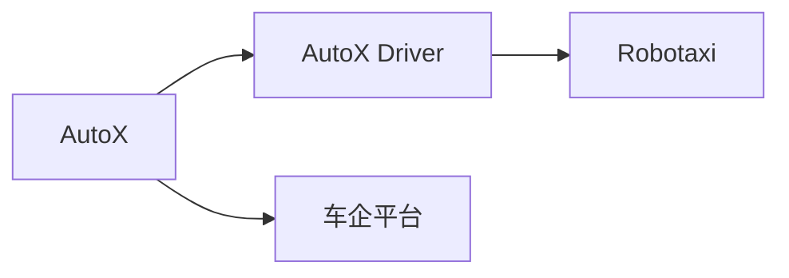
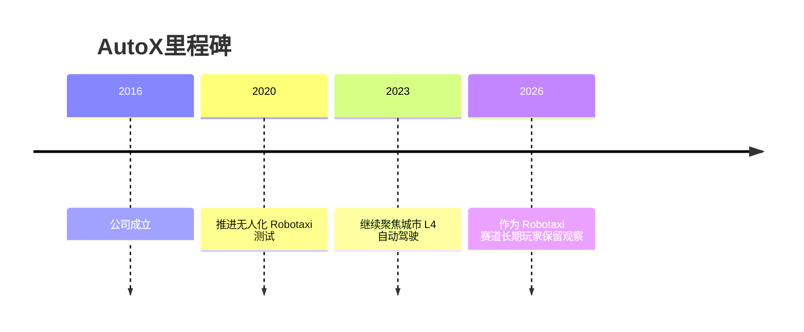

# AutoX

## 定位/主营业务

AutoX 是中美两地布局的 L4 Robotaxi 公司，强调自动驾驶系统和城市道路无人化运营能力。

## 产品矩阵

| 产品 | 定位 | 芯片 | 算力TOPS | 传感器 | 交付形态 |
| --- | --- | --- | --- | --- | --- |
| AutoX Driver | L4 自动驾驶系统 | ~ | ~ | 多传感器融合 | Robotaxi 平台 |
| RoboTaxi | 自动驾驶出行服务 | ~ | ~ | 多传感器融合 | 自运营/合作运营 |

## 合作关系

## 里程碑

## 一句话点评

AutoX 的看点在于早期无人化积累，但需要持续验证车队规模和商业化节奏。
