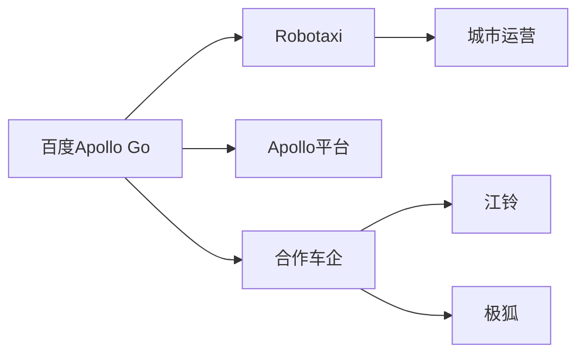
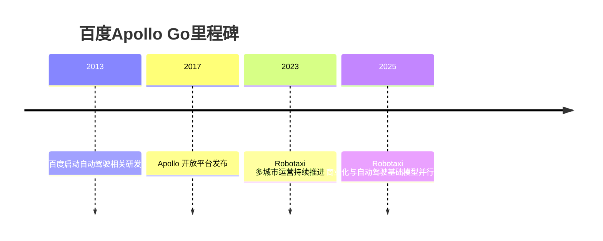

# 百度Apollo Go

## 定位/主营业务

百度 Apollo Go 是中国 Robotaxi 代表性平台之一，依托百度 Apollo 自动驾驶技术栈和地图、云、AI 能力，在开放城市道路中推进自动驾驶出行服务。

## 产品矩阵

| 产品 | 定位 | 芯片 | 算力TOPS | 传感器 | 交付形态 |
| --- | --- | --- | --- | --- | --- |
| Apollo Go | Robotaxi 服务 | ~ | ~ | 激光雷达/摄像头/雷达配置依车型 | 自运营出行 |
| Apollo ADFM | 自动驾驶基础模型 | ~ | ~ | 多模态输入 | 平台能力 |
| Apollo 自动驾驶套件 | 车企/开发者平台 | ~ | ~ | 依客户方案 | 技术开放与合作 |

## 合作关系

## 里程碑

## 一句话点评

百度 Apollo Go 的优势在于 AI 平台、地图和运营经验的组合，核心观察点是无人化比例和跨城市复制成本。
