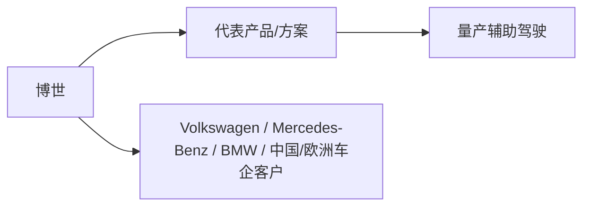
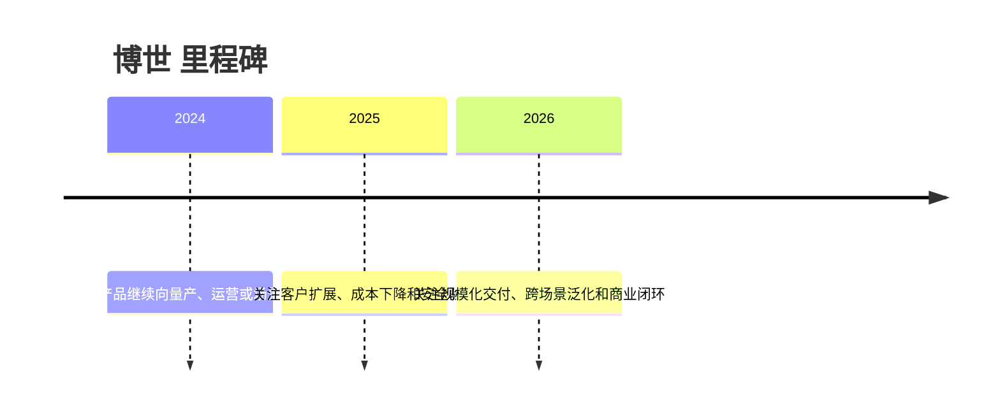

# 博世

## 定位/主营业务

面向全球车企提供 ADAS、制动、转向、域控、传感器和软件集成能力。本页用于记录公司在自动驾驶产业链中的位置、代表产品、合作关系和主要赛道；营收、估值、净利润等易变数值未核实时保持 `~`。

## 产品矩阵

| 产品 | 定位 | 芯片 | 算力TOPS | 传感器 | 交付形态 |
| --- | --- | --- | --- | --- | --- |
| Bosch ADAS | 量产辅助驾驶系统 | ~ | ~ | ~ | 前装量产 / Tier1集成 |
| Vehicle Motion Management | 底盘与运动控制 | ~ | ~ | ~ | 前装量产 / Tier1集成 |

## 合作关系

## 里程碑

## 一句话点评

博世是传统 Tier1 智驾供应链的代表，强项在车规工程和整车系统集成。
