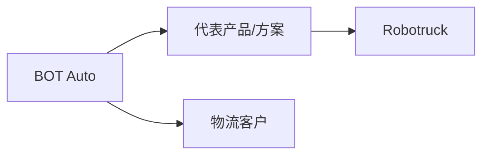
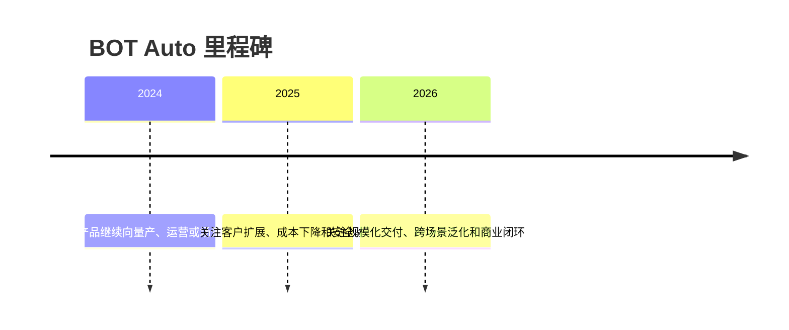

# BOT Auto

## 定位/主营业务

面向自动驾驶卡车货运的 L4 技术与运营公司。本页用于记录公司在自动驾驶产业链中的位置、代表产品、合作关系和主要赛道；营收、估值、净利润等易变数值未核实时保持 `~`。

## 产品矩阵

| 产品 | 定位 | 芯片 | 算力TOPS | 传感器 | 交付形态 |
| --- | --- | --- | --- | --- | --- |
| BOT Auto Trucking | 自动驾驶卡车系统与货运服务 | ~ | ~ | ~ | L4货运运营 |

## 合作关系

## 里程碑

## 一句话点评

BOT Auto 的核心观察点是能否把技术能力转化为稳定交付、真实运营数据和可持续商业模式。
