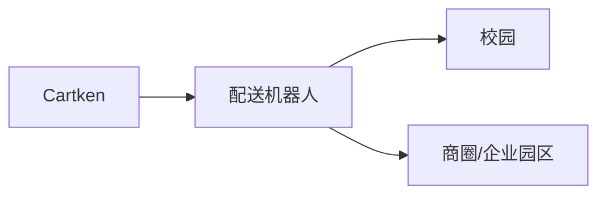
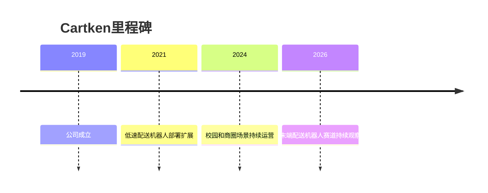

# Cartken

## 定位/主营业务

Cartken 专注低速配送机器人，服务校园、商圈、企业园区等路线相对受控的末端配送场景。

## 产品矩阵

| 产品 | 定位 | 芯片 | 算力TOPS | 传感器 | 交付形态 |
| --- | --- | --- | --- | --- | --- |
| Delivery Robot | 低速配送机器人 | ~ | ~ | 摄像头/传感器组合 | 配送服务 |

## 合作关系

## 里程碑

## 一句话点评

Cartken 是典型的小车低速路线，优势是场景简单，挑战是单车收入和维护成本。
