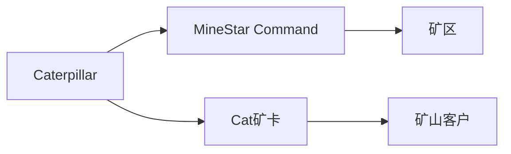
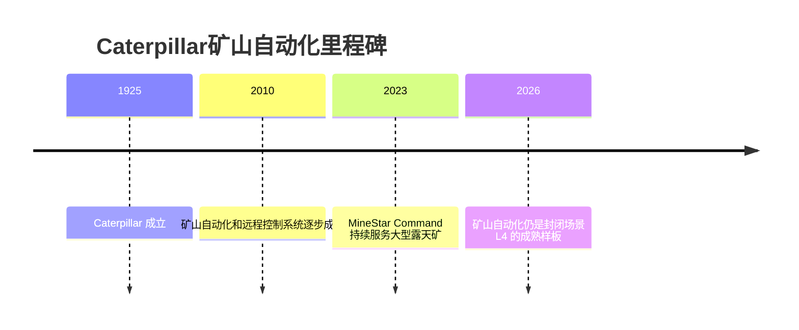

# Caterpillar

## 定位/主营业务

Caterpillar 是矿山无人运输的全球代表玩家，自动驾驶业务嵌入其矿山设备和 MineStar Command 系统中。

## 产品矩阵

| 产品 | 定位 | 芯片 | 算力TOPS | 传感器 | 交付形态 |
| --- | --- | --- | --- | --- | --- |
| MineStar Command | 矿山无人运输系统 | ~ | ~ | 多传感器与车队数据 | 设备+系统 |
| Cat 矿卡平台 | 无人矿卡车辆 | ~ | ~ | 依车型配置 | 设备销售 |

## 合作关系

## 里程碑

## 一句话点评

Caterpillar 不是创业公司，但它代表了矿区自动驾驶商业化最成熟的一类路径：设备、系统和客户场景一体化。
