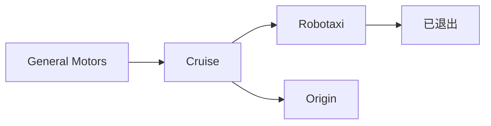
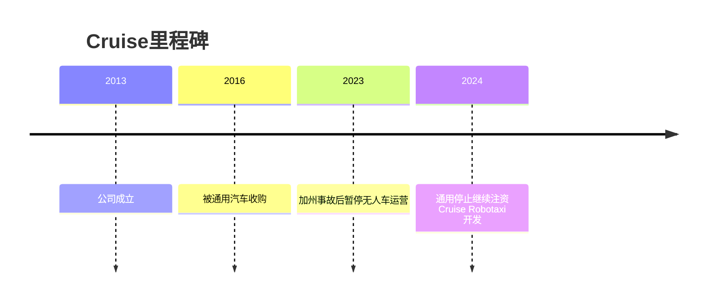

# Cruise

## 定位/主营业务

Cruise 曾是美国 Robotaxi 头部玩家，由通用汽车控股。2023 年运营暂停后，其 Robotaxi 商业化路线受到重大冲击；2024 年通用宣布不再继续为 Cruise Robotaxi 开发注资，转向整合自动驾驶能力。

## 产品矩阵

| 产品 | 定位 | 芯片 | 算力TOPS | 传感器 | 交付形态 |
| --- | --- | --- | --- | --- | --- |
| Cruise AV | Robotaxi 车辆 | ~ | ~ | 多传感器融合 | 曾用于城市运营 |
| Origin | 专用 Robotaxi 车型 | ~ | ~ | 多传感器融合 | 规划/开发中止 |

## 合作关系

## 里程碑

## 一句话点评

Cruise 是 Robotaxi 高投入、高监管风险的关键反例，提醒行业安全事件会直接改变资本和监管路径。
