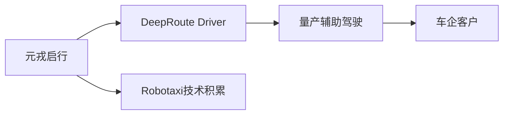
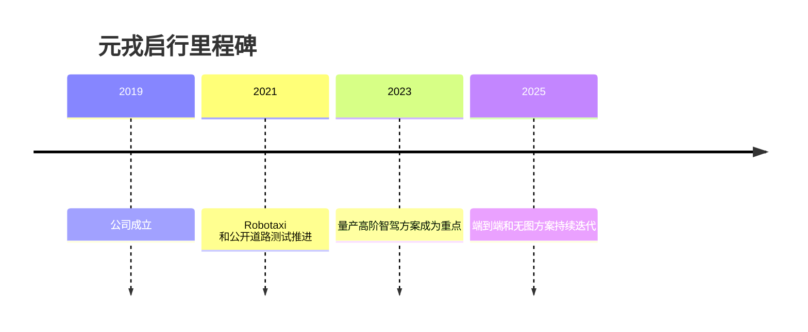

# 元戎启行

## 定位/主营业务

元戎启行从 L4 Robotaxi 技术积累切入量产智能驾驶，强调无图化、端到端和低成本量产方案。

## 产品矩阵

| 产品 | 定位 | 芯片 | 算力TOPS | 传感器 | 交付形态 |
| --- | --- | --- | --- | --- | --- |
| DeepRoute Driver | 高阶智能驾驶方案 | ~ | ~ | 摄像头/雷达/激光雷达可选 | 前装量产 |
| DeepRoute IO | 数据闭环平台 | ~ | ~ | 车端数据 | 开发平台 |

## 合作关系

## 里程碑

## 一句话点评

元戎启行代表 L4 技术向量产辅助驾驶转身的路径，关键看车企客户和低成本方案泛化能力。
