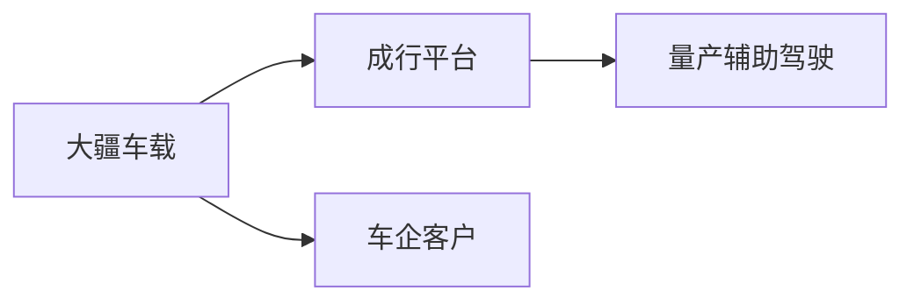
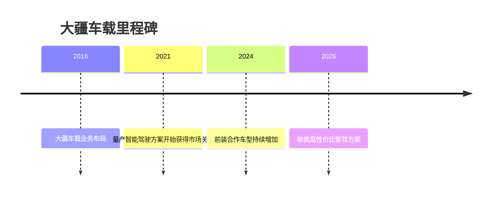

# 大疆车载

## 定位/主营业务

大疆车载依托大疆在视觉、感知和工程化硬件上的积累，向车企提供可量产的智能驾驶软硬件方案。

## 产品矩阵

| 产品 | 定位 | 芯片 | 算力TOPS | 传感器 | 交付形态 |
| --- | --- | --- | --- | --- | --- |
| 成行平台 | 智能驾驶系统 | ~ | ~ | 摄像头/毫米波雷达配置依车型 | 前装量产 |
| 视觉感知方案 | 感知系统 | ~ | ~ | 摄像头为主 | Tier1 供货 |

## 合作关系

## 里程碑

## 一句话点评

大疆车载的优势是工程化和成本控制，适合主流价格带车型的量产智驾渗透。
