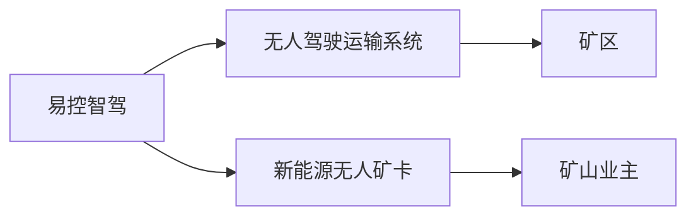
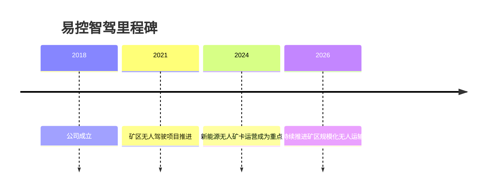

# 易控智驾

## 定位/主营业务

易控智驾聚焦矿区无人驾驶和新能源矿卡运营，通过自动驾驶系统、调度平台和运营服务服务露天矿运输。

## 产品矩阵

| 产品 | 定位 | 芯片 | 算力TOPS | 传感器 | 交付形态 |
| --- | --- | --- | --- | --- | --- |
| 矿山无人驾驶运输系统 | 无人矿卡运营 | ~ | ~ | 多传感器融合 | 矿区服务 |
| 新能源无人矿卡方案 | 纯电矿卡自动化 | ~ | ~ | 多传感器融合 | 车辆+运营 |

## 合作关系

## 里程碑

## 一句话点评

易控智驾的差异点在新能源矿卡与无人驾驶运营结合，核心指标是单吨运输成本和连续作业可靠性。
