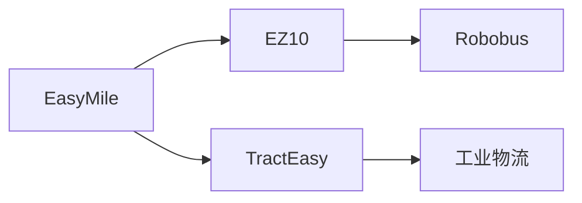
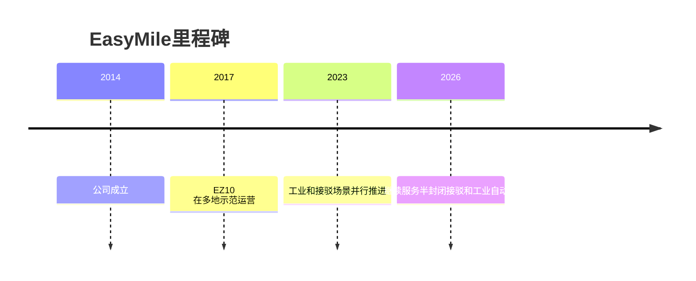

# EasyMile

## 定位/主营业务

EasyMile 是欧洲无人接驳车代表公司，产品覆盖园区、机场、校园和工业物流等半封闭场景。

## 产品矩阵

| 产品 | 定位 | 芯片 | 算力TOPS | 传感器 | 交付形态 |
| --- | --- | --- | --- | --- | --- |
| EZ10 | 无人接驳小巴 | ~ | ~ | 多传感器融合 | 车辆/服务 |
| TractEasy | 工业牵引自动化 | ~ | ~ | 多传感器融合 | 工业物流 |

## 合作关系

## 里程碑

## 一句话点评

EasyMile 的价值在于成熟的低速接驳部署经验，商业上更接近项目制和运营服务。
