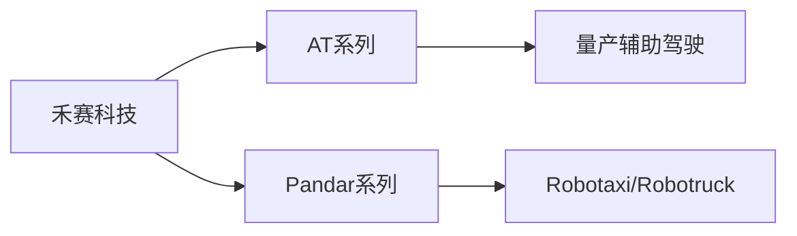
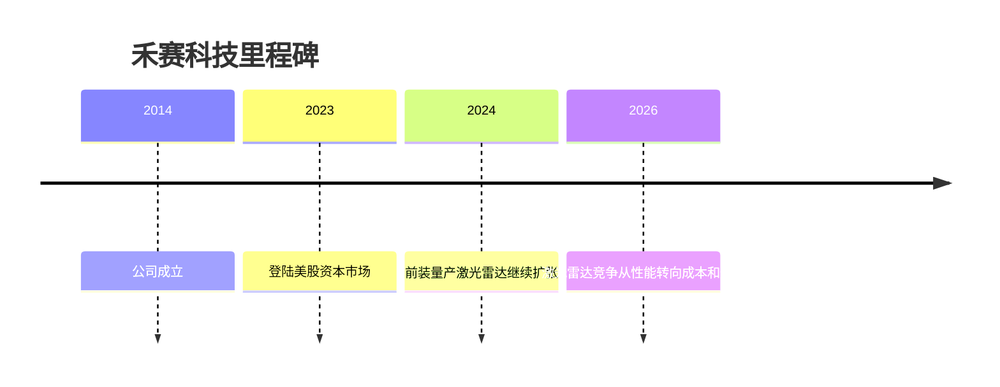

# 禾赛科技

## 定位/主营业务

禾赛科技是激光雷达头部供应商，客户覆盖量产辅助驾驶、Robotaxi、Robotruck 和机器人感知场景。

## 产品矩阵

| 产品 | 定位 | 芯片 | 算力TOPS | 传感器 | 交付形态 |
| --- | --- | --- | --- | --- | --- |
| AT 系列 | 量产车载激光雷达 | ~ | ~ | 激光雷达 | 前装供货 |
| Pandar 系列 | L4 高性能激光雷达 | ~ | ~ | 激光雷达 | L4客户供货 |

## 合作关系

## 里程碑

## 一句话点评

禾赛的核心指标是前装出货规模和毛利稳定性，激光雷达行业最终会回到车规成本竞争。
