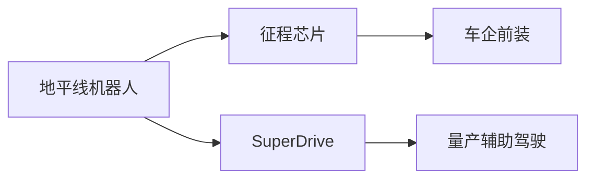
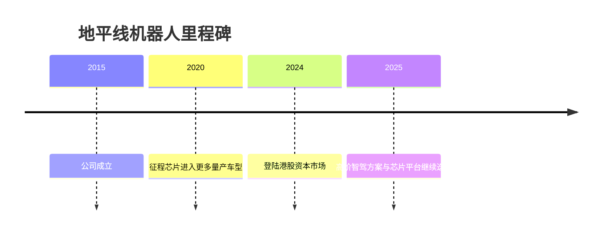

# 地平线机器人

## 定位/主营业务

地平线机器人是中国车载智能计算芯片和智驾方案商，核心产品是征程系列芯片与面向车企的量产辅助驾驶方案。

## 产品矩阵

| 产品 | 定位 | 芯片 | 算力TOPS | 传感器 | 交付形态 |
| --- | --- | --- | --- | --- | --- |
| 征程系列 | 车载智驾芯片 | Journey | ~ | 依车企方案 | 芯片销售 |
| SuperDrive | 高阶辅助驾驶方案 | Journey | ~ | 摄像头/雷达/激光雷达配置依车型 | 前装量产 |

## 合作关系

## 里程碑

## 一句话点评

地平线的关键在于用本土车规芯片生态卡位量产辅助驾驶，再向更高阶方案延伸。
