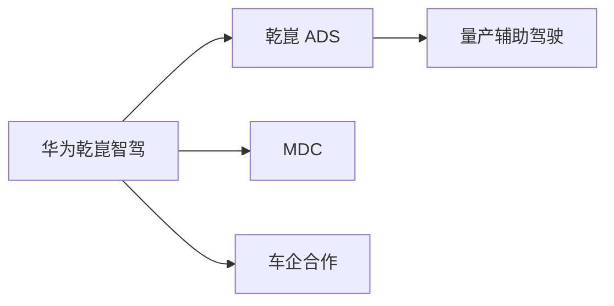
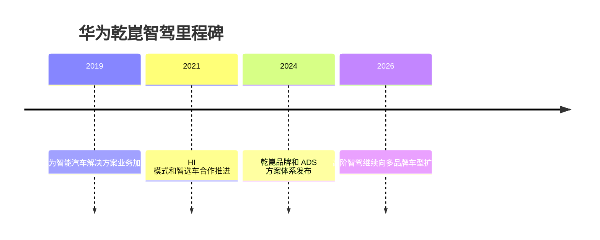

# 华为乾崑智驾

## 定位/主营业务

华为乾崑智驾是中国量产高阶辅助驾驶的重要方案，依托华为计算平台、传感器、车云和车企合作体系推进前装落地。

## 产品矩阵

| 产品 | 定位 | 芯片 | 算力TOPS | 传感器 | 交付形态 |
| --- | --- | --- | --- | --- | --- |
| 乾崑 ADS | 高阶智能驾驶系统 | MDC/车企平台 | ~ | 摄像头/毫米波雷达/激光雷达配置依车型 | 前装量产 |
| MDC | 智能驾驶计算平台 | MDC | ~ | 多传感器输入 | 零部件/平台 |

## 合作关系

## 里程碑

## 一句话点评

华为乾崑智驾的优势是全栈能力和车企合作深度，核心观察点是多品牌扩张中的标准化和成本控制。
