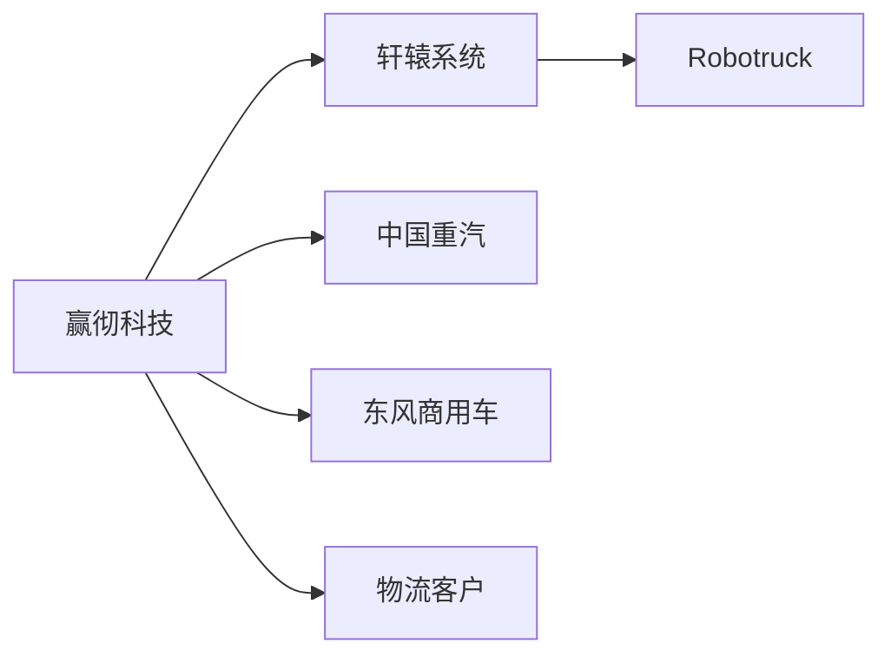
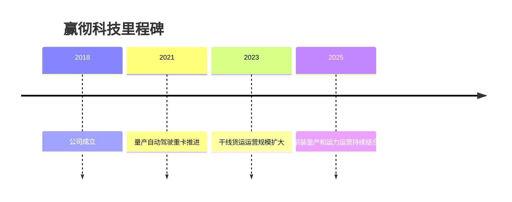

# 赢彻科技

## 定位/主营业务

赢彻科技聚焦中国干线物流自动驾驶，路线是“前装量产 + 物流运营”结合，通过轩辕系统服务自动驾驶重卡和干线运输客户。

## 产品矩阵

| 产品 | 定位 | 芯片 | 算力TOPS | 传感器 | 交付形态 |
| --- | --- | --- | --- | --- | --- |
| 轩辕自动驾驶系统 | 干线重卡自动驾驶 | ~ | ~ | 多传感器融合 | 前装量产 |
| 自动驾驶货运服务 | 物流运营 | ~ | ~ | 依车辆平台 | 运力合作 |

## 合作关系

## 里程碑

## 一句话点评

赢彻科技的优势在于中国重卡前装和物流运营结合，关键看单线经济模型和车队规模复制。
