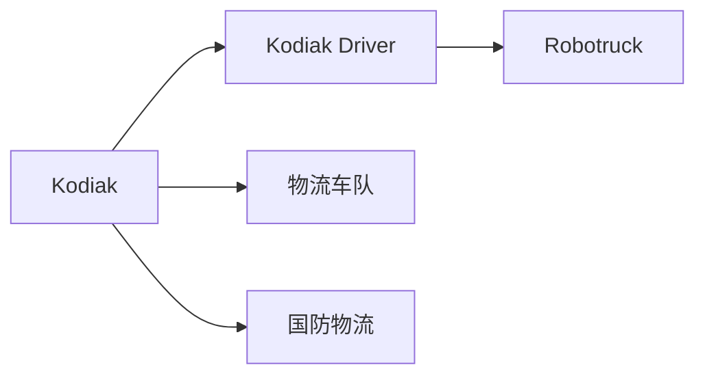
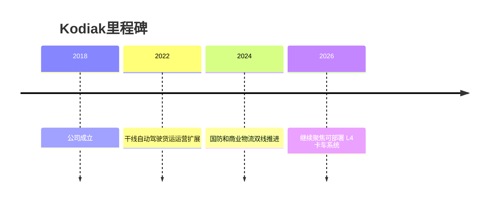

# Kodiak Robotics

## 定位/主营业务

Kodiak Robotics 聚焦自动驾驶卡车，强调模块化 SensorPods、冗余系统和可服务货运车队的 L4 Driver。

## 产品矩阵

| 产品 | 定位 | 芯片 | 算力TOPS | 传感器 | 交付形态 |
| --- | --- | --- | --- | --- | --- |
| Kodiak Driver | L4 卡车系统 | ~ | ~ | 多传感器融合 | 干线货运 |
| SensorPods | 模块化传感器舱 | ~ | ~ | 激光雷达/摄像头/雷达 | 车辆集成 |

## 合作关系

## 里程碑

## 一句话点评

Kodiak 的特点是工程化和模块化传感器设计，商业化需要持续证明车队合作和安全运营能力。
