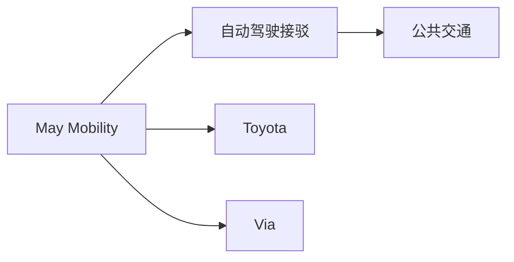
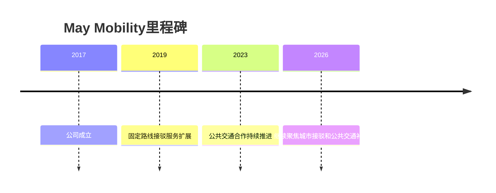

# May Mobility

## 定位/主营业务

May Mobility 主要服务固定路线和公共交通接驳，强调自动驾驶车辆与城市公共交通体系结合。

## 产品矩阵

| 产品 | 定位 | 芯片 | 算力TOPS | 传感器 | 交付形态 |
| --- | --- | --- | --- | --- | --- |
| May Mobility AV | 自动驾驶接驳车 | ~ | ~ | 多传感器融合 | 运营服务 |
| MPDM | 决策系统 | ~ | ~ | 多源感知输入 | 软件平台 |

## 合作关系

## 里程碑

## 一句话点评

May Mobility 的路线适合从固定线路切入公共交通，但规模化取决于城市采购和运营成本。
