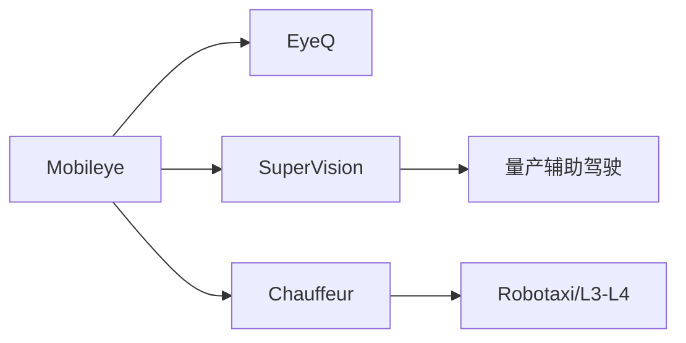
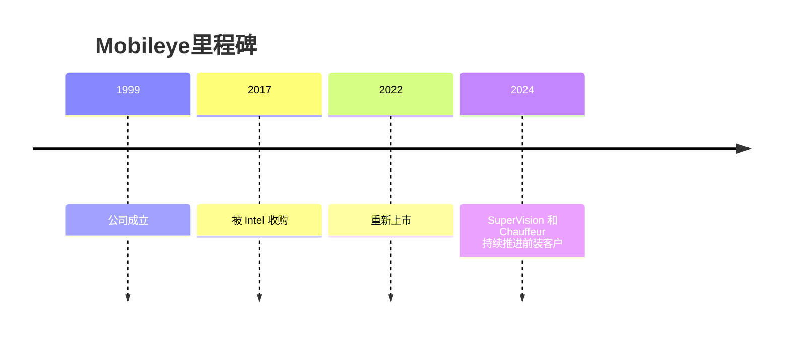

# Mobileye

## 定位/主营业务

Mobileye 是视觉辅助驾驶和车载智驾芯片头部玩家，业务从 ADAS 芯片延伸到 SuperVision、Chauffeur 和 REM 地图。

## 产品矩阵

| 产品 | 定位 | 芯片 | 算力TOPS | 传感器 | 交付形态 |
| --- | --- | --- | --- | --- | --- |
| EyeQ | 车载智驾芯片 | EyeQ | ~ | 摄像头为主 | 芯片/平台 |
| SuperVision | 高阶辅助驾驶 | EyeQ | ~ | 摄像头为主 | 前装系统 |
| Chauffeur | L3/L4 方案 | EyeQ | ~ | 摄像头+雷达/激光雷达配置 | 车企方案 |

## 合作关系

## 里程碑

## 一句话点评

Mobileye 的长期优势是车规芯片和前装客户基础，挑战是面对端到端和中国本土方案商的快速迭代。
