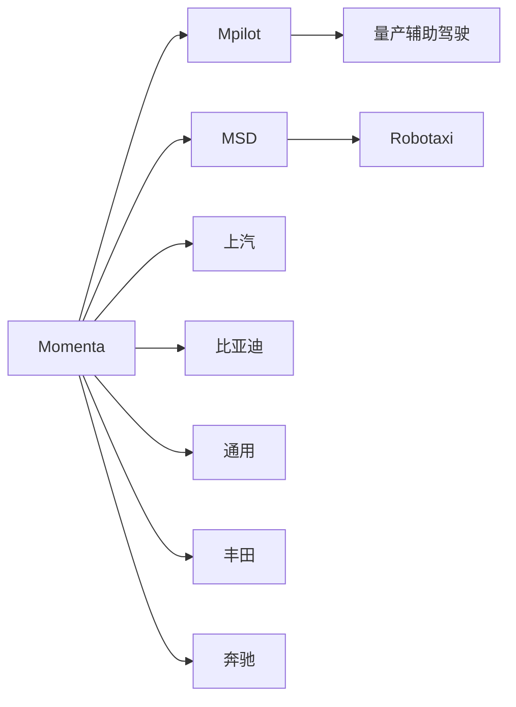
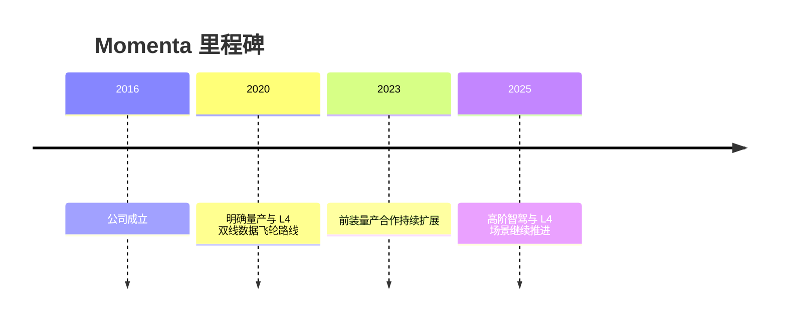

# Momenta

## 定位/主营业务

Momenta 是量产方案商 Tier1，核心叙事是“量产辅助驾驶 + L4”双线数据飞轮：通过前装量产积累长尾道路数据，再反哺高阶自动驾驶系统迭代。

## 产品矩阵

| 产品 | 定位 | 芯片 | 算力TOPS | 传感器 | 交付形态 |
| --- | --- | --- | --- | --- | --- |
| Mpilot | 量产辅助驾驶 | ~ | ~ | 摄像头/毫米波雷达/激光雷达配置依客户 | 前装量产方案 |
| MSD | 高阶自动驾驶方案 | ~ | ~ | 多传感器融合 | Robotaxi 与高阶智驾合作 |
| 数据飞轮平台 | 算法训练与闭环迭代 | ~ | ~ | 量产车数据 | 工程平台能力 |

## 合作关系

## 里程碑

## 一句话点评

Momenta 的核心价值在于用量产数据降低 L4 泛化成本，验证点是客户车型规模和端到端闭环效率。
