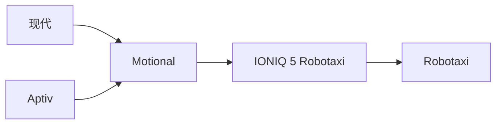
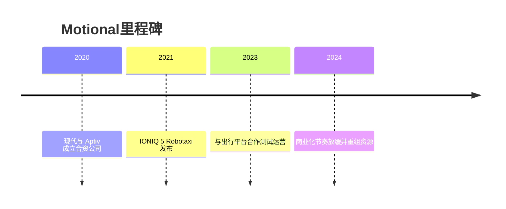

# Motional

## 定位/主营业务

Motional 是现代汽车与 Aptiv 的自动驾驶合资公司，主要围绕 IONIQ 5 Robotaxi 和 L4 出行服务技术推进商业化。

## 产品矩阵

| 产品 | 定位 | 芯片 | 算力TOPS | 传感器 | 交付形态 |
| --- | --- | --- | --- | --- | --- |
| IONIQ 5 Robotaxi | L4 Robotaxi | ~ | ~ | 激光雷达/摄像头/雷达 | 出行平台合作 |
| Motional Driver | L4 自动驾驶系统 | ~ | ~ | 多传感器融合 | 车辆平台集成 |

## 合作关系

## 里程碑

## 一句话点评

Motional 体现了车企合资 Robotaxi 路线的难度：车辆平台强，但资本持续投入和部署节奏同样关键。
