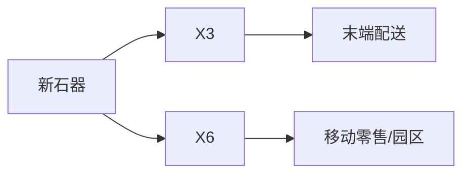
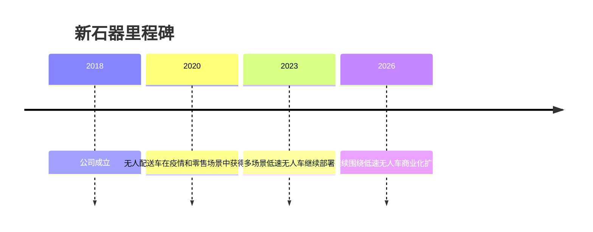

# 新石器

## 定位/主营业务

新石器是中国低速无人配送车代表公司，面向快递、零售、园区和城市服务等场景提供无人车产品和运营方案。

## 产品矩阵

| 产品 | 定位 | 芯片 | 算力TOPS | 传感器 | 交付形态 |
| --- | --- | --- | --- | --- | --- |
| X3 | 末端配送车 | ~ | ~ | 多传感器融合 | 车辆销售/运营 |
| X6 | 大载重配送/零售车 | ~ | ~ | 多传感器融合 | 场景运营 |

## 合作关系

## 里程碑

## 一句话点评

新石器的关键是把低速无人车从试点转为可复制的场景资产，尤其是运维和路权成本。
