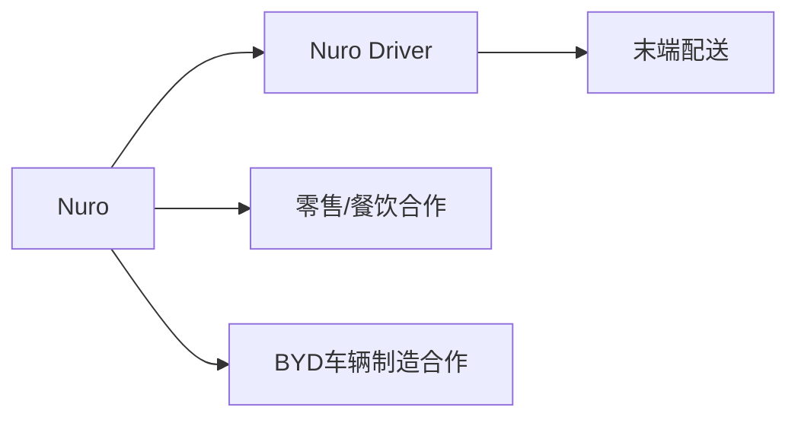
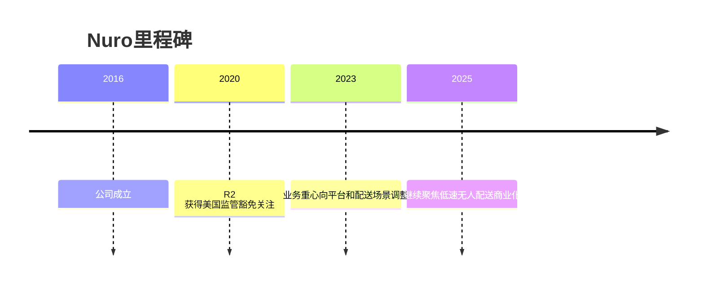

# Nuro

## 定位/主营业务

Nuro 聚焦低速无人配送，车辆不是载人车，而是面向本地零售、餐饮和社区配送的专用无人车平台。

## 产品矩阵

| 产品 | 定位 | 芯片 | 算力TOPS | 传感器 | 交付形态 |
| --- | --- | --- | --- | --- | --- |
| Nuro Driver | 无人配送自动驾驶系统 | ~ | ~ | 多传感器融合 | 配送平台 |
| R2/R3 | 专用无人配送车 | ~ | ~ | 多传感器融合 | 零售/餐饮配送 |

## 合作关系

## 里程碑

## 一句话点评

Nuro 的路线绕开载人安全难度，但商业化上必须证明订单密度能覆盖车辆、运维和远程运营成本。
