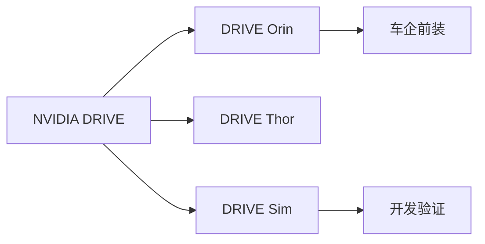
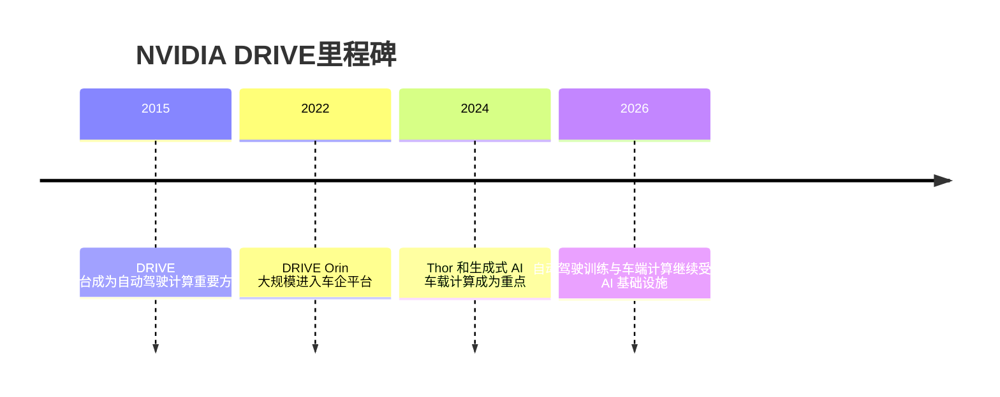

# NVIDIA DRIVE

## 定位/主营业务

NVIDIA DRIVE 是自动驾驶计算和开发生态的重要平台，覆盖车端芯片、训练基础设施和仿真工具。

## 产品矩阵

| 产品 | 定位 | 芯片 | 算力TOPS | 传感器 | 交付形态 |
| --- | --- | --- | --- | --- | --- |
| DRIVE Orin | 车载 SoC | Orin | ~ | 多传感器输入 | 芯片/平台 |
| DRIVE Thor | 集中式车载计算 | Thor | ~ | 多传感器输入 | 芯片/平台 |
| DRIVE Sim | 仿真平台 | 数据中心 GPU | ~ | 仿真数据 | 开发工具 |

## 合作关系

## 里程碑

## 一句话点评

NVIDIA 的优势不是单个自动驾驶应用，而是覆盖训练、仿真和车端计算的 AI 基础设施。
