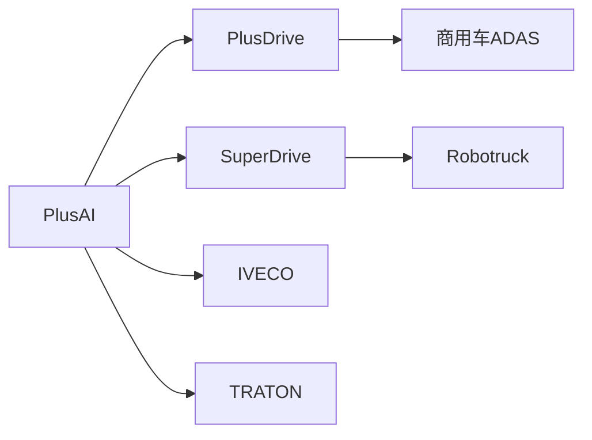
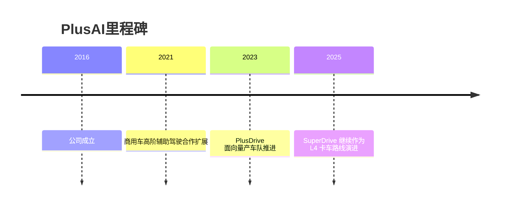

# PlusAI

## 定位/主营业务

PlusAI 面向商用车自动驾驶，产品同时覆盖可量产的高阶辅助驾驶 PlusDrive 和面向 L4 的 SuperDrive。

## 产品矩阵

| 产品 | 定位 | 芯片 | 算力TOPS | 传感器 | 交付形态 |
| --- | --- | --- | --- | --- | --- |
| PlusDrive | 商用车高阶辅助驾驶 | ~ | ~ | 摄像头/雷达配置依车型 | 前装/后装方案 |
| SuperDrive | L4 自动驾驶卡车系统 | ~ | ~ | 多传感器融合 | Robotruck 平台 |

## 合作关系

## 里程碑

## 一句话点评

PlusAI 的路线更偏“先量产 ADAS，再演进 L4”，相对纯 L4 公司更强调近期商业收入。
