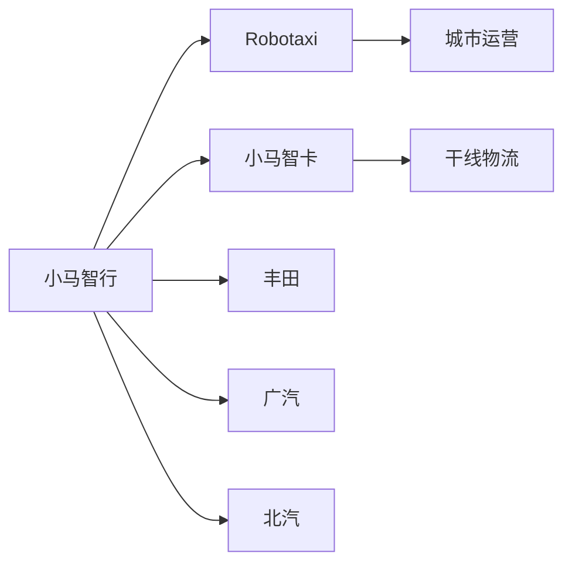
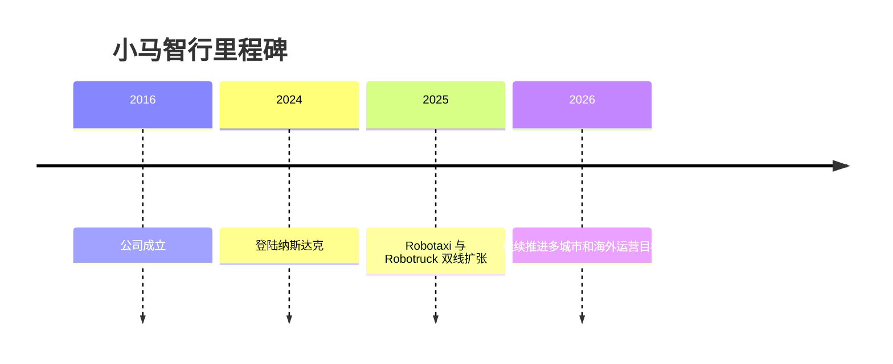

# 小马智行

## 定位/主营业务

小马智行是中美双总部的 L4 自动驾驶公司，业务以 Robotaxi 和小马智卡双线推进。Robotaxi 侧重城市载客运营与多 OEM 平台合作，Robotruck 侧重干线物流降本增效。

## 产品矩阵

| 产品 | 定位 | 芯片 | 算力TOPS | 传感器 | 交付形态 |
| --- | --- | --- | --- | --- | --- |
| PonyPilot | Robotaxi 服务 | ~ | ~ | 激光雷达/摄像头/毫米波雷达 | 自运营与合作运营 |
| 小马智卡 | 干线物流自动驾驶 | ~ | ~ | 激光雷达/摄像头/毫米波雷达 | 运力运营与物流合作 |
| Gen-7 系统 | 规模化 Robotaxi 平台 | ~ | ~ | 多传感器融合 | 前装/合作车型部署 |

## 合作关系

## 里程碑

## 一句话点评

小马智行的关键变量是 Robotaxi 车队规模、单车经济模型和 Robotruck 业务能否共同摊薄 L4 技术成本。
