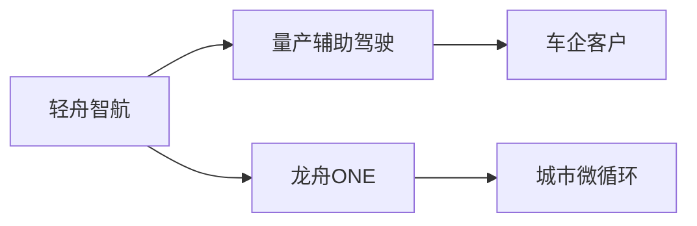
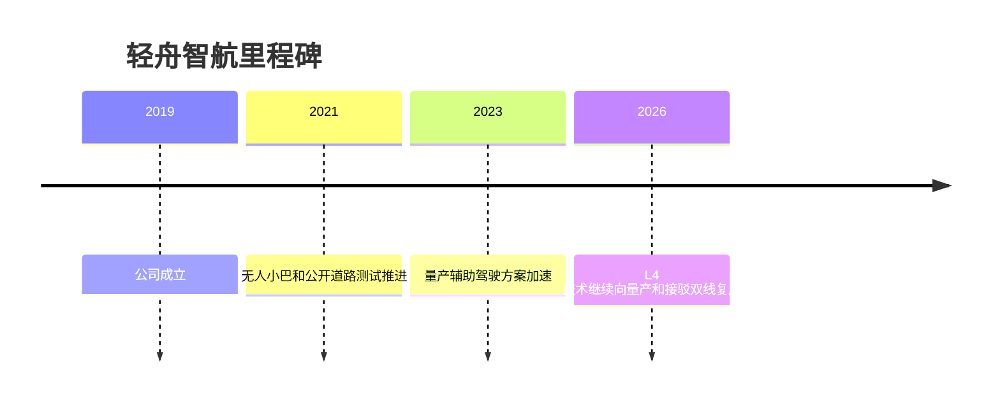

# 轻舟智航

## 定位/主营业务

轻舟智航以 L4 技术平台向量产辅助驾驶和无人小巴延展，既做车企高阶智驾方案，也做城市微循环接驳。

## 产品矩阵

| 产品 | 定位 | 芯片 | 算力TOPS | 传感器 | 交付形态 |
| --- | --- | --- | --- | --- | --- |
| Driven-by-QCraft | 高阶辅助驾驶 | ~ | ~ | 依客户配置 | 前装量产 |
| 龙舟ONE | 无人小巴 | ~ | ~ | 多传感器融合 | 接驳运营 |

## 合作关系

## 里程碑

## 一句话点评

轻舟智航的看点是 L4 技术平台能否在前装量产和 Robobus 两端同时形成客户规模。
