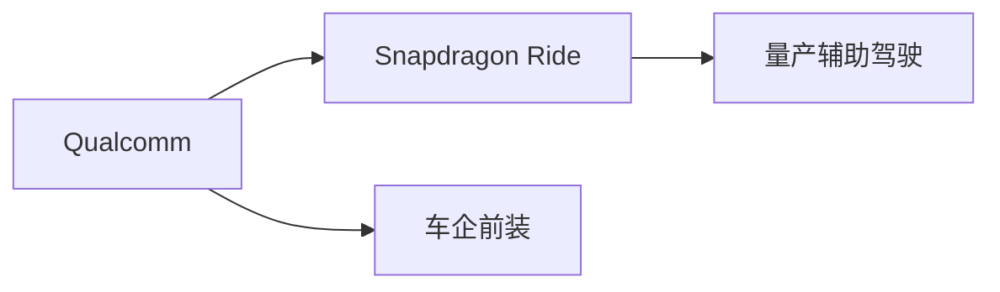
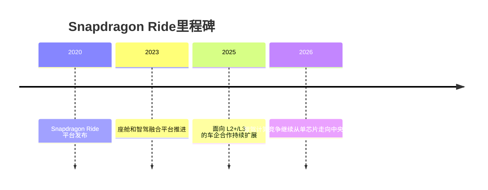

# Qualcomm Snapdragon Ride

## 定位/主营业务

Qualcomm 通过 Snapdragon Ride 切入智能驾驶计算，优势在汽车 SoC、座舱和通信生态，面向 L2+/L3 量产辅助驾驶。

## 产品矩阵

| 产品 | 定位 | 芯片 | 算力TOPS | 传感器 | 交付形态 |
| --- | --- | --- | --- | --- | --- |
| Snapdragon Ride | 智能驾驶计算平台 | Snapdragon Ride | ~ | 多传感器输入 | 芯片/平台 |
| Ride Flex | 座舱智驾融合 | Ride Flex | ~ | 多传感器输入 | 中央计算平台 |

## 合作关系

## 里程碑

## 一句话点评

Qualcomm 的关键机会在于用座舱和通信生态带动智驾计算平台进入更多主流车型。
