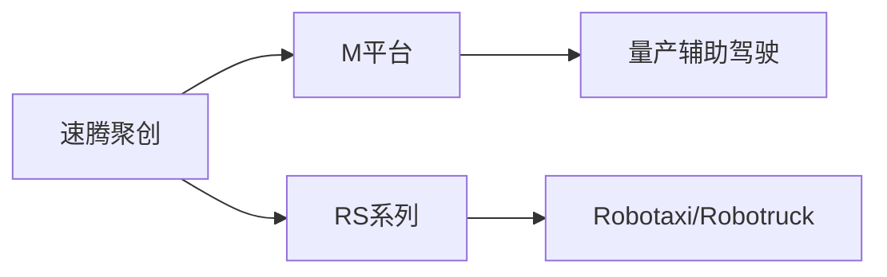
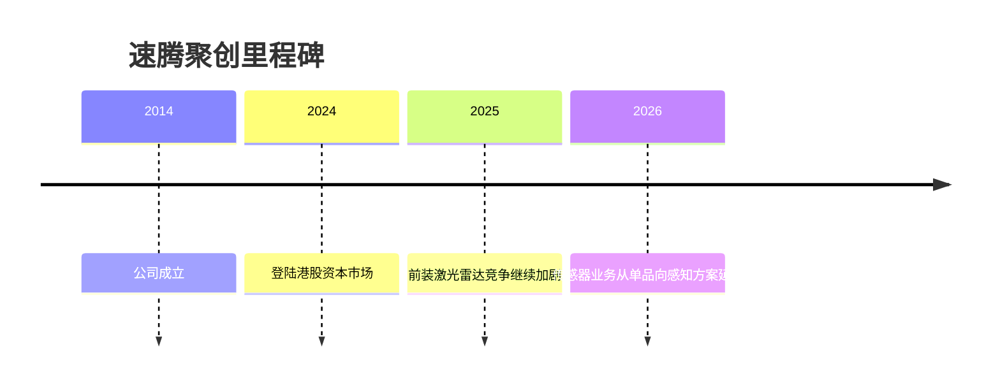

# 速腾聚创

## 定位/主营业务

速腾聚创是车载激光雷达和感知方案供应商，客户覆盖乘用车量产和 L4 自动驾驶项目。

## 产品矩阵

| 产品 | 定位 | 芯片 | 算力TOPS | 传感器 | 交付形态 |
| --- | --- | --- | --- | --- | --- |
| M 平台 | 量产车载激光雷达 | ~ | ~ | 激光雷达 | 前装供货 |
| RS 系列 | 高性能激光雷达 | ~ | ~ | 激光雷达 | L4/研发客户 |

## 合作关系

## 里程碑

## 一句话点评

速腾聚创的竞争重点是车规交付能力、成本下降速度和与主机厂平台绑定深度。
