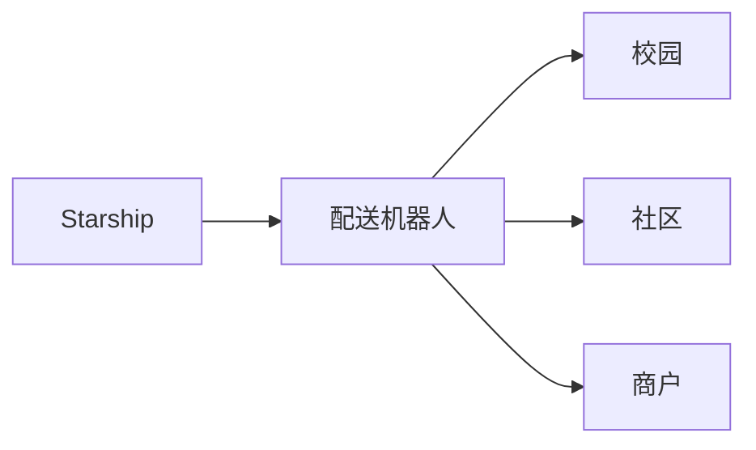
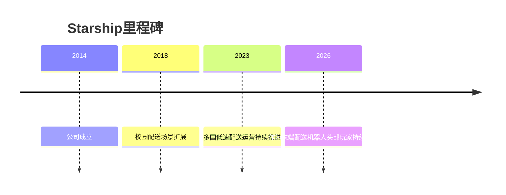

# Starship Technologies

## 定位/主营业务

Starship 是人行道配送机器人代表公司，聚焦校园、社区和商业区的短途配送，而不是开放道路车辆自动驾驶。

## 产品矩阵

| 产品 | 定位 | 芯片 | 算力TOPS | 传感器 | 交付形态 |
| --- | --- | --- | --- | --- | --- |
| Delivery Robot | 低速配送机器人 | ~ | ~ | 摄像头/传感器组合 | 配送服务 |

## 合作关系

## 里程碑

## 一句话点评

Starship 的优势是低速轻资产场景清晰，但上限取决于校园和社区订单密度。
