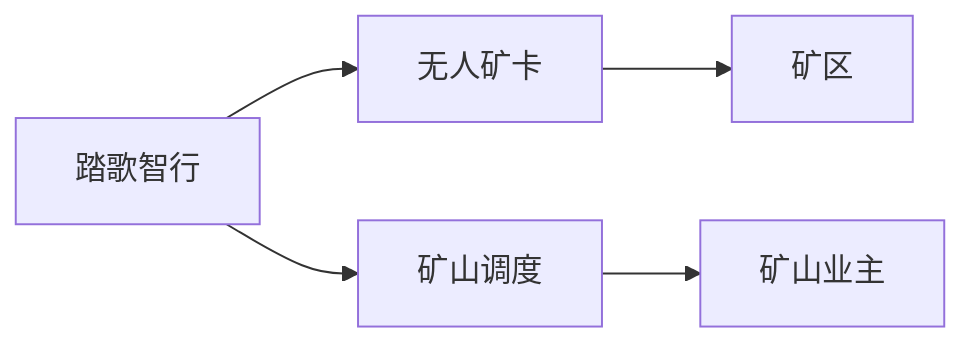
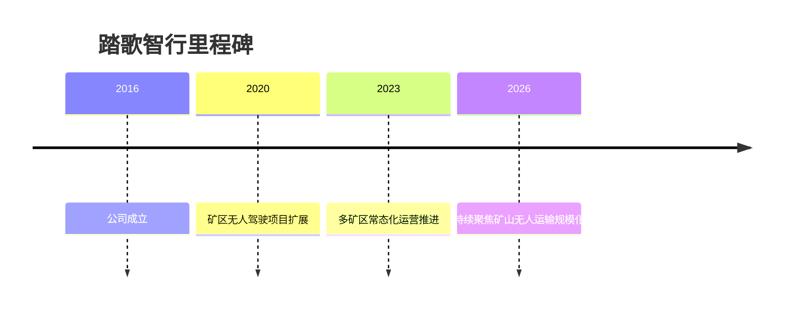

# 踏歌智行

## 定位/主营业务

踏歌智行聚焦露天矿无人驾驶，提供无人矿卡、调度平台和矿区运营系统，目标是降低矿区运输成本并提升安全性。

## 产品矩阵

| 产品 | 定位 | 芯片 | 算力TOPS | 传感器 | 交付形态 |
| --- | --- | --- | --- | --- | --- |
| 露天矿无人驾驶系统 | 无人矿卡运输 | ~ | ~ | 多传感器融合 | 矿区项目 |
| 智能调度平台 | 矿区车队调度 | ~ | ~ | 运营数据 | 系统交付 |

## 合作关系

## 里程碑

## 一句话点评

踏歌智行的关键是矿区长期运营能力，不只是车辆自动驾驶能力。
