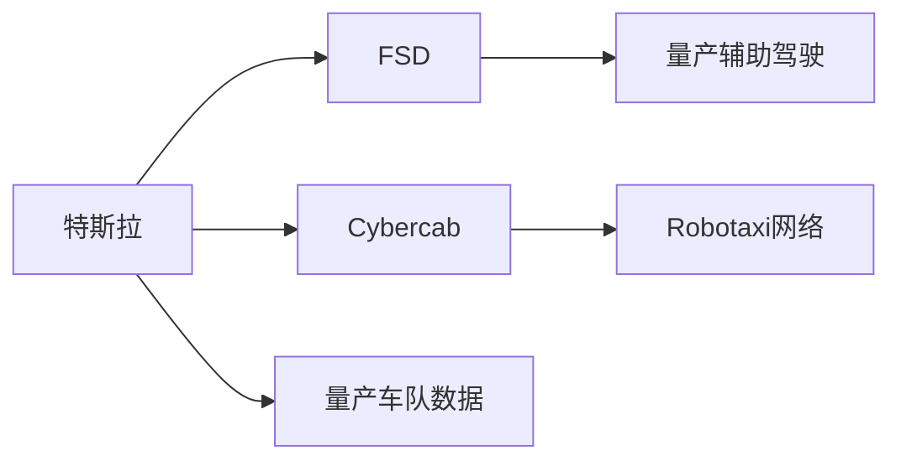
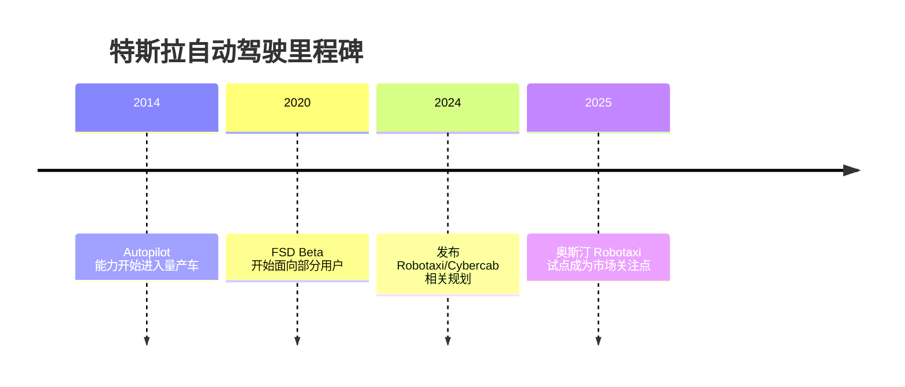

# 特斯拉

## 定位/主营业务

特斯拉以量产车辆数据、端到端模型和纯视觉路线推进 FSD，并将 Robotaxi 网络作为长期商业想象。它既是车企，也是自动驾驶软件和潜在出行平台玩家。

## 产品矩阵

| 产品 | 定位 | 芯片 | 算力TOPS | 传感器 | 交付形态 |
| --- | --- | --- | --- | --- | --- |
| FSD | 量产辅助驾驶软件 | Tesla HW | ~ | 摄像头为主 | 软件订阅/买断 |
| Autopilot | 基础辅助驾驶 | Tesla HW | ~ | 摄像头为主 | 整车标配/选装 |
| Cybercab | Robotaxi 专用车型 | ~ | ~ | 摄像头为主 | 规划中出行网络 |

## 合作关系

## 里程碑

## 一句话点评

特斯拉最大的变量是用量产数据和低成本传感器路线跨越 L2+/L4 鸿沟，这条路线潜在收益极高、监管和安全争议也最高。
