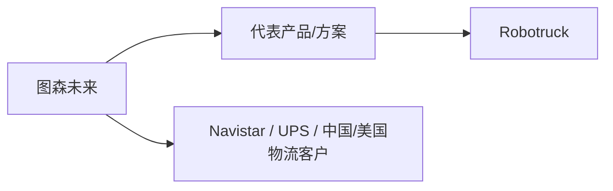
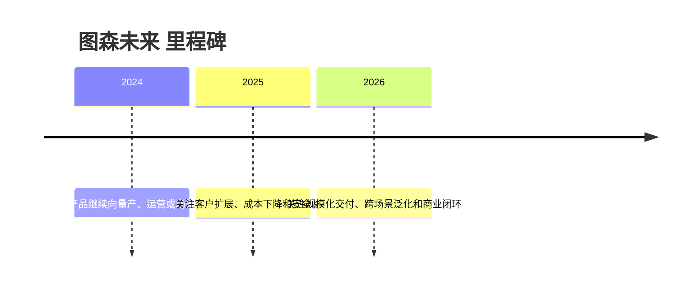

# 图森未来

## 定位/主营业务

曾面向干线物流开发 L4 自动驾驶卡车系统，后退出自动驾驶货运主线。本页用于记录公司在自动驾驶产业链中的位置、代表产品、合作关系和主要赛道；营收、估值、净利润等易变数值未核实时保持 `~`。

## 产品矩阵

| 产品 | 定位 | 芯片 | 算力TOPS | 传感器 | 交付形态 |
| --- | --- | --- | --- | --- | --- |
| TuSimple L4 Truck | 自动驾驶卡车系统 | ~ | ~ | ~ | 历史项目 |

## 合作关系

## 里程碑

## 一句话点评

图森未来是 Robotruck 早期明星案例，退出后仍可作为赛道风险和商业化节奏的参照。
