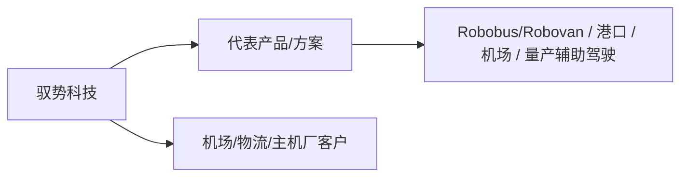
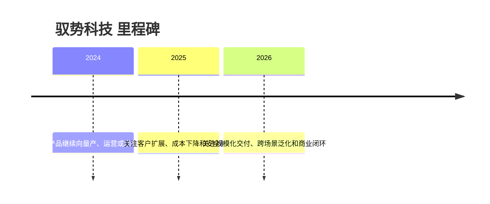

# 驭势科技

## 定位/主营业务

面向机场、厂区、物流和出行场景提供 L4 自动驾驶系统和运营服务。本页用于记录公司在自动驾驶产业链中的位置、代表产品、合作关系和主要赛道；营收、估值、净利润等易变数值未核实时保持 `~`。

## 产品矩阵

| 产品 | 定位 | 芯片 | 算力TOPS | 传感器 | 交付形态 |
| --- | --- | --- | --- | --- | --- |
| UISEE Autonomous Driving Platform | L4自动驾驶平台 | ~ | ~ | ~ | L4系统 / 场景运营 |
| 无人牵引车/接驳车 | 场景车辆 | ~ | ~ | ~ | L4系统 / 场景运营 |

## 合作关系

## 里程碑

## 一句话点评

驭势科技 的核心观察点是能否把技术能力转化为稳定交付、真实运营数据和可持续商业模式。
