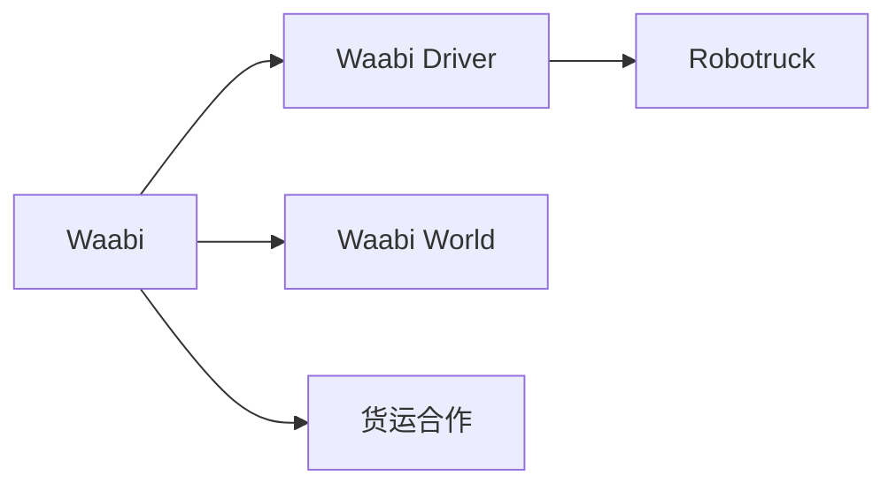
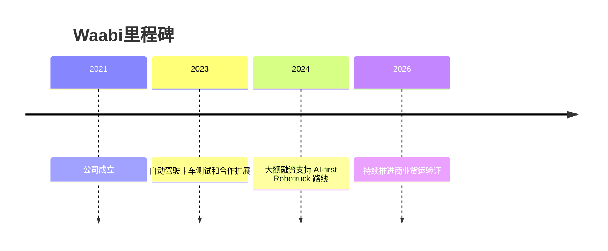

# Waabi

## 定位/主营业务

Waabi 以 AI-first 和仿真驱动为核心叙事，目标是用 Waabi World 提升自动驾驶卡车系统的训练和安全验证效率。

## 产品矩阵

| 产品 | 定位 | 芯片 | 算力TOPS | 传感器 | 交付形态 |
| --- | --- | --- | --- | --- | --- |
| Waabi Driver | L4 卡车自动驾驶系统 | ~ | ~ | 多传感器融合 | 干线货运 |
| Waabi World | 仿真训练与验证平台 | ~ | ~ | 仿真数据 | 开发平台 |

## 合作关系

## 里程碑

## 一句话点评

Waabi 的独特性在于仿真和生成式 AI 方法论，关键是仿真优势能否转化为真实道路安全与部署速度。
