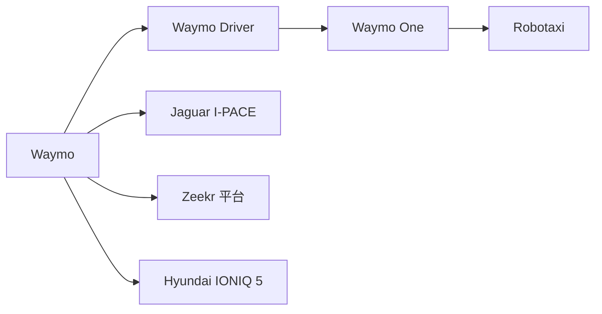
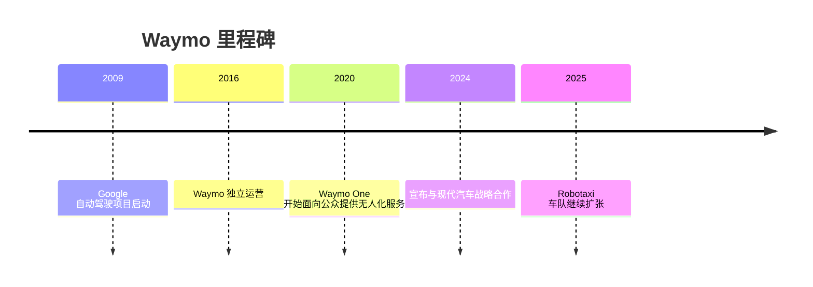

# Waymo

## 定位/主营业务

Waymo 是 Alphabet 旗下 L4 Robotaxi 运营商，核心资产是软硬一体的 Waymo Driver。技术路线强调多传感器冗余、重激光雷达、高精地图和长期道路运营闭环，商业化抓手是 Waymo One 自运营出行服务。

## 产品矩阵

| 产品 | 定位 | 芯片 | 算力TOPS | 传感器 | 交付形态 |
| --- | --- | --- | --- | --- | --- |
| Waymo Driver | L4 自动驾驶系统 | ~ | ~ | 激光雷达/摄像头/毫米波雷达 | 自运营车队与车企平台集成 |
| Waymo One | Robotaxi 服务 | ~ | ~ | 依车辆平台配置 | 面向乘客的出行服务 |
| Zeekr/Hyundai 平台 | 下一代量产平台 | ~ | ~ | 第六代 Waymo Driver 传感器套件 | 平台合作 |

## 合作关系

## 里程碑

## 一句话点评

Waymo 的优势是运营闭环和安全冗余，短板观察点是车队扩张速度、车辆成本和跨城市复制效率。
