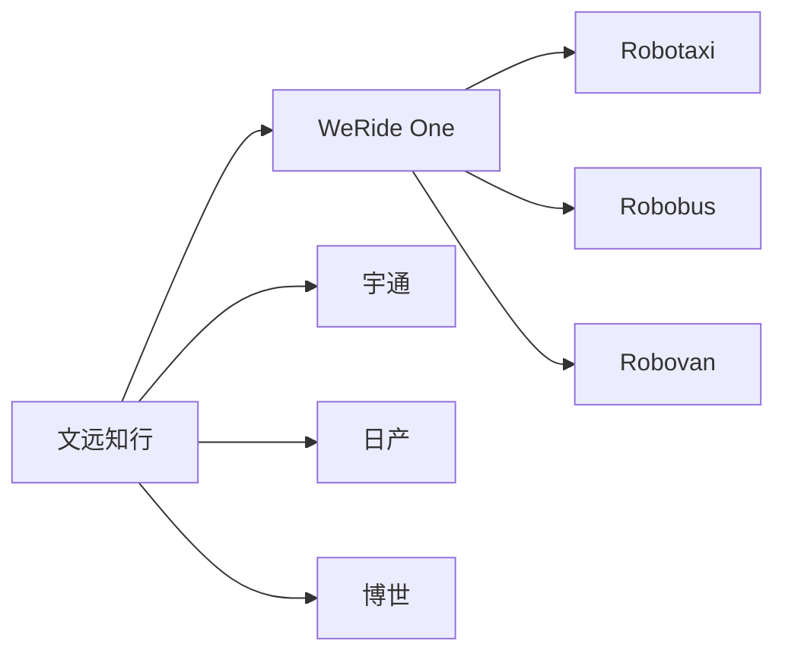
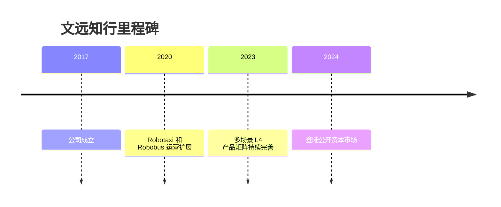

# 文远知行

## 定位/主营业务

文远知行是 L4 综合型自动驾驶公司，产品覆盖 Robotaxi、Robobus、Robovan 和城市服务车辆。它的特点是将同一套 L4 技术平台在多种车辆和运营场景中复用。

## 产品矩阵

| 产品 | 定位 | 芯片 | 算力TOPS | 传感器 | 交付形态 |
| --- | --- | --- | --- | --- | --- |
| Robotaxi | 自动驾驶出行 | ~ | ~ | 多传感器融合 | 自运营/合作运营 |
| Robobus | 无人小巴 | ~ | ~ | 多传感器融合 | 固定路线接驳 |
| Robovan | 无人货运车 | ~ | ~ | 多传感器融合 | 城市物流 |
| WeRide One | L4 平台 | ~ | ~ | 多车型适配 | 技术平台 |

## 合作关系

## 里程碑

## 一句话点评

文远知行的关键价值在于多场景复用 L4 平台，但也需要证明每个垂类都有足够清晰的商业闭环。
