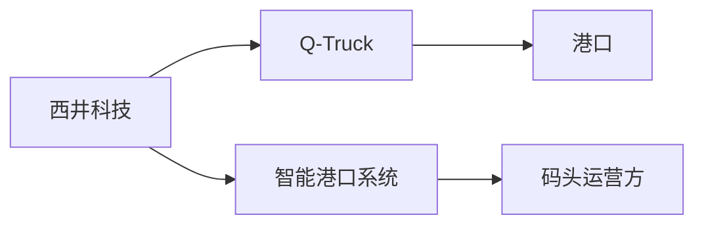
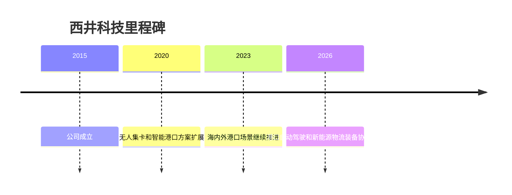

# 西井科技

## 定位/主营业务

西井科技聚焦智能港口和物流自动化，核心产品包括无人驾驶电动集卡 Q-Truck 和港口智能调度系统。

## 产品矩阵

| 产品 | 定位 | 芯片 | 算力TOPS | 传感器 | 交付形态 |
| --- | --- | --- | --- | --- | --- |
| Q-Truck | 无人驾驶电动集卡 | ~ | ~ | 多传感器融合 | 港区运营 |
| WellOcean | 智能港口系统 | ~ | ~ | 调度数据 | 系统集成 |

## 合作关系

## 里程碑

## 一句话点评

西井科技的壁垒在港区场景理解和调度系统，自动驾驶车辆是智能港口方案的一部分。
