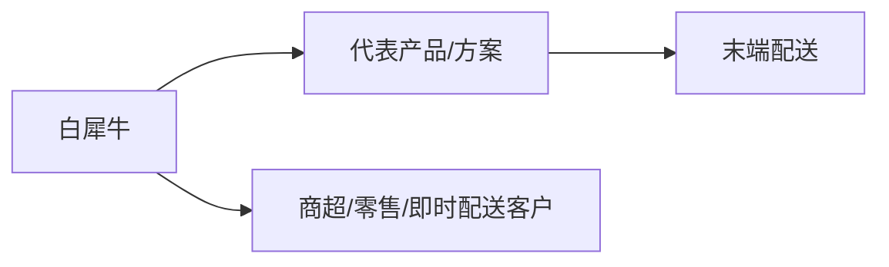
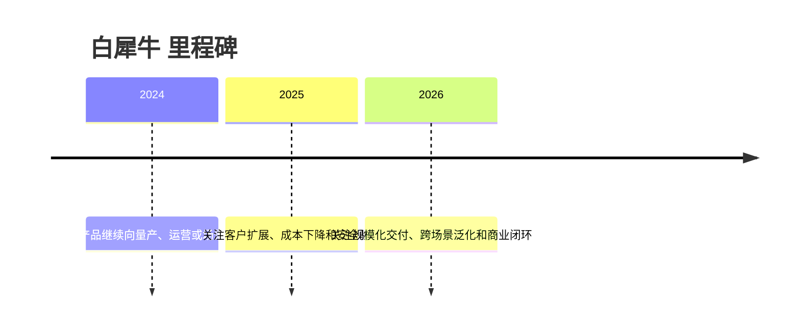

# 白犀牛

## 定位/主营业务

面向商超、社区和即时零售场景的无人配送车与运营服务。本页用于记录公司在自动驾驶产业链中的位置、代表产品、合作关系和主要赛道；营收、估值、净利润等易变数值未核实时保持 `~`。

## 产品矩阵

| 产品 | 定位 | 芯片 | 算力TOPS | 传感器 | 交付形态 |
| --- | --- | --- | --- | --- | --- |
| 白犀牛无人配送车 | 低速无人配送车 | ~ | ~ | ~ | 自运营 / 场景交付 |
| 配送运营平台 | 无人配送调度系统 | ~ | ~ | ~ | 自运营 / 场景交付 |

## 合作关系

## 里程碑

## 一句话点评

白犀牛 的核心观察点是能否把技术能力转化为稳定交付、真实运营数据和可持续商业模式。
