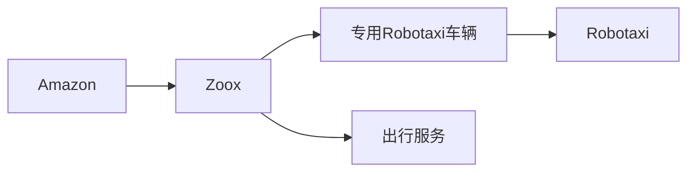
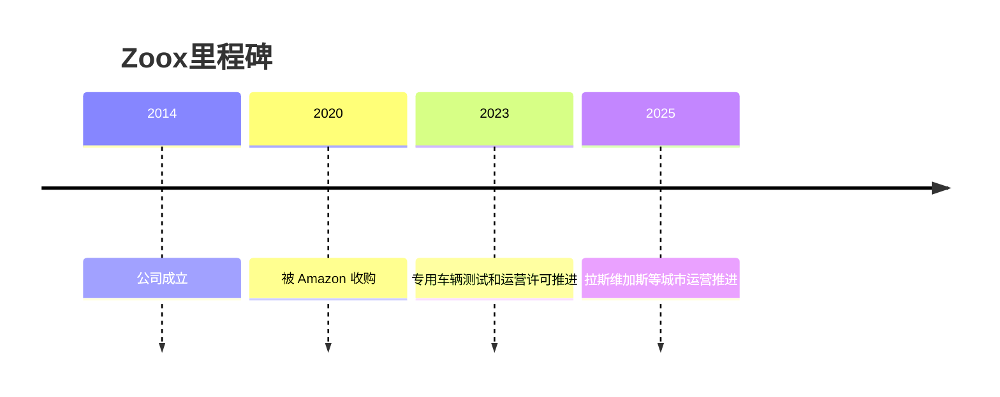

# Zoox

## 定位/主营业务

Zoox 走专用 Robotaxi 车辆路线，核心不是在现有乘用车上加装 L4 套件，而是开发面向共享出行的双向、无方向盘车辆平台。

## 产品矩阵

| 产品 | 定位 | 芯片 | 算力TOPS | 传感器 | 交付形态 |
| --- | --- | --- | --- | --- | --- |
| Zoox Robotaxi | 专用无人载客车 | ~ | ~ | 多传感器 360° 感知 | 自运营 |
| Zoox 服务平台 | Robotaxi 出行 | ~ | ~ | 依车辆平台 | 城市运营 |

## 合作关系

## 里程碑

## 一句话点评

Zoox 是最典型的“专用车 + 自运营”路线，成败取决于专用车型量产成本和城市许可扩张速度。
