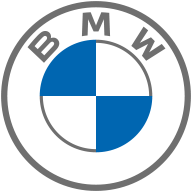
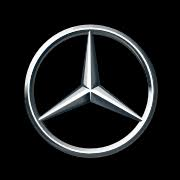
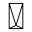
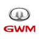
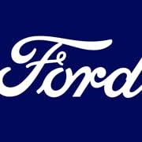
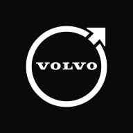
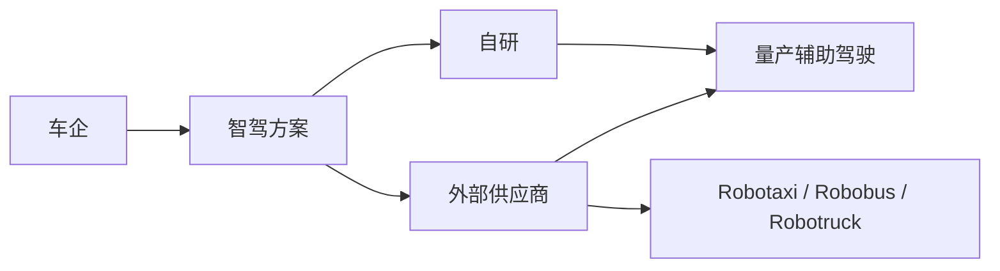

# 车企 OEM

车企页面记录整车厂的高阶智驾路线、供应商关系、代表车型和赛道布局。结构化字段只维护在各实体页 YAML front-matter 中。

## 车企索引

索引按 `梯队` 分组，用于快速比较车企的国家/地区、核心品牌、核心产品、智驾方案、2025 年营收/利润和销量驱动因素。财务字段以各公司 2025 年度或相邻 2025 财年公开披露为准，外币按 ECB 2025 年均汇率折算为人民币亿元；未独立披露的子品牌在实体页 `财务口径` 中标注对应母公司、上市主体或分部口径。

<!-- AUTO:START oems-table -->
### 第一梯队｜全球规模与智驾标杆

| 车标 | 车企 | 国家 | 类型 | 核心品牌 | 核心产品 | 智驾方案 | 销量好原因 | 状态 | 营收_亿元 | 净利润_亿元 |
| --- | --- | --- | --- | --- | --- | --- | --- | --- | --- | --- |
|  | [宝马](bmw.md) | 德国 | 外资 | BMW / MINI / Rolls-Royce | 3 Series / 5 Series / X5 / iX | BMW Personal Pilot / Highway Assistant | 豪华品牌、全球渠道、燃油/电动产品组合和驾驶体验认知稳固，是销量韧性的主要来源。 | 已上市 | 10834.39 | 604.91 |
|  | [比亚迪](byd.md) | 中国 | 传统自主 | 比亚迪 / 腾势 / 方程豹 / 仰望 | 秦 / 宋 / 海鸥 / 汉 / 腾势D9 | 天神之眼 / DiPilot | 电池和电驱垂直整合、车型价格带完整、插混/纯电双线覆盖和渠道下沉共同驱动销量。 | 已上市 | 8039.65 | 326.19 |
|  | [吉利汽车](geely.md) | 中国 | 传统自主 | 吉利 / 银河 / 领克 / 极氪 / 几何 | 银河E8 / 银河L7 / 极氪001 / 领克08 | 浩瀚智驾 / 千里浩瀚 | 多品牌矩阵、燃油和新能源并行、供应链与海外布局支撑规模，平台化智驾提升竞争力。 | 已上市 | 3452.32 | 168.52 |
|  | [现代汽车](hyundai.md) | 韩国 | 外资 | Hyundai / Genesis / IONIQ | IONIQ 5 / IONIQ 6 / Santa Fe / Tucson | Hyundai SmartSense / Motional / Waymo合作 | 全球化制造和渠道、电动平台产品力、性价比和多区域市场布局共同支撑销量。 | 已上市 | 9418.58 | 523.89 |
|  | [梅赛德斯-奔驰](mercedes-benz.md) | 德国 | 外资 | Mercedes-Benz / Mercedes-AMG / Maybach | S-Class / E-Class / EQS / GLC | Drive Pilot / MB.OS | 豪华品牌、全球渠道、产品覆盖和高端客户基础稳固，L3 合规能力强化技术形象。 | 已上市 | 10733.8 | 432.8 |
|  | [特斯拉](tesla.md) | 美国 | 外资 | Tesla | Model Y / Model 3 / Cybertruck / Model S | Autopilot / FSD / Robotaxi | 品牌认知、三电效率、直营体系、全球产能和 FSD/软件叙事共同驱动销量。 | 已上市 | 6812.96 | 272.58 |
|  | [丰田](toyota.md) | 日本 | 外资 | Toyota / Lexus | Corolla / Camry / RAV4 / Prius / bZ4X | Toyota Safety Sense / Woven / Guardian | 可靠性、混动技术、全球渠道和车型覆盖极广，是全球销量长期领先的核心。 | 已上市 | 23070.01 | 2288.69 |
|  | [大众集团](volkswagen.md) | 德国 | 外资 | Volkswagen / Audi / Porsche / Skoda / Cupra | Golf / Tiguan / ID.4 / Porsche Macan EV | CARIAD / ADAS平台 | 多品牌集团规模、欧洲/中国基本盘和平台化制造能力强，软件整合影响电动化竞争力。 | 已上市 | 26134.52 | 560.5 |

### 第二梯队｜中国高阶智驾主力

| 车标 | 车企 | 国家 | 类型 | 核心品牌 | 核心产品 | 智驾方案 | 销量好原因 | 状态 | 营收_亿元 | 净利润_亿元 |
| --- | --- | --- | --- | --- | --- | --- | --- | --- | --- | --- |
|  | [阿维塔](avatr.md) | 中国 | 传统自主 | 阿维塔 | 阿维塔11 / 阿维塔12 / 阿维塔07 | 华为乾崑智驾 / ADS | 长安制造、华为智驾和宁德时代电池形成高端新能源标签，销量依赖华为生态声量和产品价格带下探。 | 活跃 | 1640.0 | 40.75 |
|  | [长安汽车](changan.md) | 中国 | 传统自主 | 长安 / 深蓝 / 启源 / 阿维塔 | 深蓝S07 / 启源A07 / 阿维塔12 / 长安启源E07 | SDA / 天枢智驾 | 传统渠道和多品牌新能源矩阵覆盖主流价格带，华为合作与自研平台增强智驾标签。 | 已上市 | 1640.0 | 40.75 |
|  | [奇瑞汽车](chery.md) | 中国 | 传统自主 | 奇瑞 / 星途 / 捷途 / iCAR | 瑞虎 / 风云T9 / 星纪元ES / 捷途山海T2 | 猎鹰智驾 / i-Drive | 出口优势、燃油车基本盘和多品牌 SUV 矩阵支撑规模，新能源与智驾补齐带来增量。 | 活跃 | 3002.87 | 195.07 |
|  | [腾势](denza.md) | 中国 | 传统自主 | 腾势 | 腾势D9 / 腾势N7 / 腾势Z9GT | 天神之眼 / DiPilot | 比亚迪供应链和高端 MPV 爆款带来销量基础，高阶智驾和豪华体验决定持续性。 | 活跃 | 8039.65 | 326.19 |
|  | [广汽埃安](gac-aion.md) | 中国 | 传统自主 | 埃安 / 昊铂 | AION Y / AION V / 昊铂HT / 昊铂GT | ADiGO PILOT / 星灵架构 | 网约/家庭市场基础、广汽制造体系和主流价格带产品推动销量，智能化升级影响品牌向上。 | 活跃 | 965.42 | -87.84 |
|  | [长城汽车](great-wall.md) | 中国 | 传统自主 | 哈弗 / 魏牌 / 坦克 / 欧拉 | 哈弗H6 / 魏牌蓝山 / 坦克300 / 坦克500 | Coffee Pilot / NOH | SUV/越野品类认知强、燃油基本盘稳，新能源转型和毫末智驾体验决定增量。 | 已上市 | 2228.24 | 98.65 |
|  | [智己汽车](im-motors.md) | 中国 | 传统自主 | 智己 | 智己L6 / 智己LS6 / 智己LS7 | IM AD | 上汽资源、Momenta 智驾和中高端新能源产品定位带来增长，销量依赖爆款车型持续性。 | 活跃 | 6562.44 | 101.06 |
|  | [零跑汽车](leapmotor.md) | 中国 | 新势力 | 零跑 | C10 / C11 / C16 / T03 | Leapmotor Pilot | 主流价格带、增程/纯电组合和高配置性价比推动销量，Stellantis 合作带来海外增量想象。 | 已上市 | 647.32 | 5.38 |
|  | [理想汽车](li-auto.md) | 中国 | 新势力 | 理想 | L6 / L7 / L8 / L9 / MEGA | 理想AD Max / 端到端智驾 | 家庭 SUV 定位清晰、增程补能焦虑低、座舱体验强和渠道效率高，是销量领先的核心。 | 已上市 | 1123.13 | 11.24 |
|  | [蔚来](nio.md) | 中国 | 新势力 | 蔚来 / 乐道 / 萤火虫 | ES6 / ET5 / ET7 / 乐道L60 | NAD / NOP+ | 换电体系、用户运营和高端服务形成差异化，销量增长依赖子品牌下探和成本改善。 | 已上市 | 874.88 | -155.71 |
|  | [上汽集团](saic.md) | 中国 | 传统自主 | 上汽乘用车 / 智己 / 飞凡 / MG / 荣威 | 智己L6 / 智己LS6 / MG4 / 荣威D7 | 智己IM AD / 飞凡RISING PILOT | 集团规模、出口品牌 MG 和多品牌矩阵支撑销量，智驾和新能源爆款决定国内增量。 | 已上市 | 6562.44 | 101.06 |
|  | [赛力斯/问界](seres-aito.md) | 中国 | 传统自主 | 问界 / 赛力斯 | 问界M7 / 问界M8 / 问界M9 / 问界M5 | 华为乾崑智驾 / ADS | 华为渠道和智驾品牌强拉动、增程 SUV 定位清晰、旗舰车型带动品牌向上。 | 已上市 | 1650.54 | 59.57 |
|  | [小鹏汽车](xpeng.md) | 中国 | 新势力 | 小鹏 | G9 / P7 / X9 / MONA M03 | XNGP + 图灵芯片 | 自研智驾标签、主流价格带新品和大众合作提升关注度，销量依赖产品节奏与渠道效率。 | 已上市 | 767.2 | -11.39 |
|  | [小米汽车](xiaomi-auto.md) | 中国 | 新势力 | 小米汽车 | SU7 / YU7 | Xiaomi Pilot / 端到端智驾 | 小米品牌流量、生态协同、产品定价和智能座舱体验带来强关注度，产能释放决定销量兑现。 | 活跃 | 1061.0 | 9.0 |
|  | [极氪](zeekr.md) | 中国 | 传统自主 | 极氪 | 极氪001 / 极氪007 / 极氪009 / 极氪MIX | NZP / 浩瀚智驾 | 吉利平台、猎装/MPV 差异化产品和高性能电动车标签驱动销量，智驾体验决定高端粘性。 | 已上市 | 3452.32 | 168.52 |

### 第三梯队｜海外主流智驾跟进

| 车标 | 车企 | 国家 | 类型 | 核心品牌 | 核心产品 | 智驾方案 | 销量好原因 | 状态 | 营收_亿元 | 净利润_亿元 |
| --- | --- | --- | --- | --- | --- | --- | --- | --- | --- | --- |
|  | [奥迪](audi.md) | 德国 | 外资 | Audi | Q6 e-tron / A6 e-tron / Q8 e-tron | Audi assisted driving / PPE平台 | 豪华品牌积累、燃油车用户基础和集团平台能力支撑销量，电动化与智能化转型速度决定后续表现。 | 已上市 | 5317.86 | 374.83 |
|  | [福特](ford.md) | 美国 | 外资 | Ford / Lincoln | F-150 / Mustang Mach-E / Explorer / Bronco | BlueCruise | 皮卡和 SUV 基本盘强、北美渠道稳定，电动化和 BlueCruise 普及决定新增长。 | 已上市 | 13454.43 | -587.85 |
|  | [通用汽车](general-motors.md) | 美国 | 外资 | Chevrolet / Cadillac / GMC / Buick | Silverado / Escalade / HUMMER EV / Equinox EV | Super Cruise / Ultra Cruise | 北美皮卡/SUV 基本盘、品牌覆盖广和经销体系强，Cruise 收缩后更依赖 Super Cruise 量产体验。 | 已上市 | 13292.92 | 193.77 |
|  | [本田](honda.md) | 日本 | 外资 | Honda / Acura | Civic / Accord / CR-V / Legend | Honda SENSING / SENSING Elite | 可靠性口碑、全球渠道和混动产品支撑销量，智驾策略偏稳健。 | 已上市 | 10416.25 | 401.4 |
|  | [捷豹路虎](jaguar-land-rover.md) | 英国 | 外资 | Jaguar / Land Rover / Range Rover / Defender | Range Rover / Defender / Jaguar I-PACE | JLR assisted driving / Waymo车辆平台合作 | 豪华 SUV 和越野品牌资产支撑高客单价，电动化更新节奏影响销量弹性。 | 活跃 | 2747.88 | 170.56 |
|  | [起亚](kia.md) | 韩国 | 外资 | Kia | EV6 / EV9 / K5 / Sportage | Kia DriveWise | 全球渠道、设计和性价比优势明显，电动车平台和集团技术复用提升竞争力。 | 已上市 | 5771.92 | 381.99 |
|  | [日产](nissan.md) | 日本 | 外资 | Nissan / Infiniti | Ariya / Leaf / Serena / Altima | ProPILOT | 全球渠道和经济型车型基础较强，ProPILOT 有早期积累，但新能源换代速度影响竞争力。 | 已上市 | 5766.93 | -256.03 |
|  | [雷诺集团](renault.md) | 法国 | 外资 | Renault / Dacia / Alpine | Renault 5 E-Tech / Megane E-Tech / Dacia Sandero | ADAS / Ampere软件平台 | 欧洲小车和性价比品牌基础稳，电动小车和 Dacia 成本优势支撑销量。 | 已上市 | 4753.38 | 61.05 |
|  | [Stellantis](stellantis.md) | 荷兰 | 外资 | Jeep / Peugeot / Fiat / Ram / Citroën | Ram 1500 / Jeep Wagoneer / Peugeot e-3008 | STLA AutoDrive | 多品牌全球覆盖、北美皮卡和欧洲小车基础强，但软件和电动化平台整合是关键挑战。 | 已上市 | 12462.55 | -1813.02 |
|  | [沃尔沃汽车](volvo.md) | 瑞典 | 外资 | Volvo | EX90 / EX30 / XC60 / XC90 | Pilot Assist / Safe Space Technology | 安全品牌心智、SUV 产品和吉利体系支持销量，激光雷达和电动化提升技术标签。 | 已上市 | 2621.24 | -21.77 |

### 第四梯队｜特色/区域/新势力样本

| 车标 | 车企 | 国家 | 类型 | 核心品牌 | 核心产品 | 智驾方案 | 销量好原因 | 状态 | 营收_亿元 | 净利润_亿元 |
| --- | --- | --- | --- | --- | --- | --- | --- | --- | --- | --- |
|  | [极狐汽车](arcfox.md) | 中国 | 传统自主 | 极狐 | 阿尔法S / 阿尔法T / 考拉 | 华为HI / α-Pilot | 依托北汽新能源平台和华为/百度合作形成智驾标签，但品牌声量和渠道规模仍是主要约束。 | 活跃 | 279.4 | -45.63 |
|  | [红旗](hongqi.md) | 中国 | 传统自主 | 红旗 | H9 / E-HS9 / EH7 | 红旗智能驾驶 | 高端自主品牌认知和政商务场景支撑销量，新能源与智能化转型仍需扩大用户面。 | 活跃 | 626.78 | 7.25 |
|  | [Lucid Motors](lucid.md) | 美国 | 新势力 | Lucid | Lucid Air / Lucid Gravity | DreamDrive | 高端电动车性能和续航标签突出，但价格高、渠道和产品线有限，销量仍处爬坡阶段。 | 已上市 | 97.26 | -193.84 |
|  | [Polestar](polestar.md) | 瑞典 | 外资 | Polestar | Polestar 2 / Polestar 3 / Polestar 4 | Pilot Assist / 高阶辅助驾驶 | 北欧设计和沃尔沃/吉利平台背书形成品牌认知，但渠道、价格和产品节奏限制规模。 | 已上市 | 219.71 | -169.36 |
|  | [Rivian](rivian.md) | 美国 | 新势力 | Rivian | R1T / R1S / EDV / R2 | Driver+ / Autonomy Platform | 户外电动皮卡/SUV 和亚马逊配送车订单形成差异化，但产能、成本和价格限制规模。 | 已上市 | 387.04 | -261.95 |
|  | [岚图汽车](voyah.md) | 中国 | 传统自主 | 岚图 | 岚图FREE / 岚图梦想家 / 岚图追光 | 岚图智驾 / 华为方案合作 | 东风体系和高端新能源定位支撑基本盘，销量提升依赖渠道、价格和智驾方案强化。 | 活跃 | 348.65 | 10.17 |
<!-- AUTO:END oems-table -->

## 按国家/车系分类

车系分类由 YAML 字段 `国家` 自动推导：中系、德系、日系、韩系、美系和欧系其他。它用于快速回答“哪些是德系车、哪些是日系车”等问题。

<!-- AUTO:START oems-family-table -->
### 中系｜中国品牌

| 车标 | 车企 | 国家 | 梯队 | 核心品牌 | 核心产品 | 智驾方案 | 销量好原因 | 营收_亿元 | 净利润_亿元 |
| --- | --- | --- | --- | --- | --- | --- | --- | --- | --- |
|  | [比亚迪](byd.md) | 中国 | 第一梯队｜全球规模与智驾标杆 | 比亚迪 / 腾势 / 方程豹 / 仰望 | 秦 / 宋 / 海鸥 / 汉 / 腾势D9 | 天神之眼 / DiPilot | 电池和电驱垂直整合、车型价格带完整、插混/纯电双线覆盖和渠道下沉共同驱动销量。 | 8039.65 | 326.19 |
|  | [吉利汽车](geely.md) | 中国 | 第一梯队｜全球规模与智驾标杆 | 吉利 / 银河 / 领克 / 极氪 / 几何 | 银河E8 / 银河L7 / 极氪001 / 领克08 | 浩瀚智驾 / 千里浩瀚 | 多品牌矩阵、燃油和新能源并行、供应链与海外布局支撑规模，平台化智驾提升竞争力。 | 3452.32 | 168.52 |
|  | [阿维塔](avatr.md) | 中国 | 第二梯队｜中国高阶智驾主力 | 阿维塔 | 阿维塔11 / 阿维塔12 / 阿维塔07 | 华为乾崑智驾 / ADS | 长安制造、华为智驾和宁德时代电池形成高端新能源标签，销量依赖华为生态声量和产品价格带下探。 | 1640.0 | 40.75 |
|  | [长安汽车](changan.md) | 中国 | 第二梯队｜中国高阶智驾主力 | 长安 / 深蓝 / 启源 / 阿维塔 | 深蓝S07 / 启源A07 / 阿维塔12 / 长安启源E07 | SDA / 天枢智驾 | 传统渠道和多品牌新能源矩阵覆盖主流价格带，华为合作与自研平台增强智驾标签。 | 1640.0 | 40.75 |
|  | [奇瑞汽车](chery.md) | 中国 | 第二梯队｜中国高阶智驾主力 | 奇瑞 / 星途 / 捷途 / iCAR | 瑞虎 / 风云T9 / 星纪元ES / 捷途山海T2 | 猎鹰智驾 / i-Drive | 出口优势、燃油车基本盘和多品牌 SUV 矩阵支撑规模，新能源与智驾补齐带来增量。 | 3002.87 | 195.07 |
|  | [腾势](denza.md) | 中国 | 第二梯队｜中国高阶智驾主力 | 腾势 | 腾势D9 / 腾势N7 / 腾势Z9GT | 天神之眼 / DiPilot | 比亚迪供应链和高端 MPV 爆款带来销量基础，高阶智驾和豪华体验决定持续性。 | 8039.65 | 326.19 |
|  | [广汽埃安](gac-aion.md) | 中国 | 第二梯队｜中国高阶智驾主力 | 埃安 / 昊铂 | AION Y / AION V / 昊铂HT / 昊铂GT | ADiGO PILOT / 星灵架构 | 网约/家庭市场基础、广汽制造体系和主流价格带产品推动销量，智能化升级影响品牌向上。 | 965.42 | -87.84 |
|  | [长城汽车](great-wall.md) | 中国 | 第二梯队｜中国高阶智驾主力 | 哈弗 / 魏牌 / 坦克 / 欧拉 | 哈弗H6 / 魏牌蓝山 / 坦克300 / 坦克500 | Coffee Pilot / NOH | SUV/越野品类认知强、燃油基本盘稳，新能源转型和毫末智驾体验决定增量。 | 2228.24 | 98.65 |
|  | [智己汽车](im-motors.md) | 中国 | 第二梯队｜中国高阶智驾主力 | 智己 | 智己L6 / 智己LS6 / 智己LS7 | IM AD | 上汽资源、Momenta 智驾和中高端新能源产品定位带来增长，销量依赖爆款车型持续性。 | 6562.44 | 101.06 |
|  | [零跑汽车](leapmotor.md) | 中国 | 第二梯队｜中国高阶智驾主力 | 零跑 | C10 / C11 / C16 / T03 | Leapmotor Pilot | 主流价格带、增程/纯电组合和高配置性价比推动销量，Stellantis 合作带来海外增量想象。 | 647.32 | 5.38 |
|  | [理想汽车](li-auto.md) | 中国 | 第二梯队｜中国高阶智驾主力 | 理想 | L6 / L7 / L8 / L9 / MEGA | 理想AD Max / 端到端智驾 | 家庭 SUV 定位清晰、增程补能焦虑低、座舱体验强和渠道效率高，是销量领先的核心。 | 1123.13 | 11.24 |
|  | [蔚来](nio.md) | 中国 | 第二梯队｜中国高阶智驾主力 | 蔚来 / 乐道 / 萤火虫 | ES6 / ET5 / ET7 / 乐道L60 | NAD / NOP+ | 换电体系、用户运营和高端服务形成差异化，销量增长依赖子品牌下探和成本改善。 | 874.88 | -155.71 |
|  | [上汽集团](saic.md) | 中国 | 第二梯队｜中国高阶智驾主力 | 上汽乘用车 / 智己 / 飞凡 / MG / 荣威 | 智己L6 / 智己LS6 / MG4 / 荣威D7 | 智己IM AD / 飞凡RISING PILOT | 集团规模、出口品牌 MG 和多品牌矩阵支撑销量，智驾和新能源爆款决定国内增量。 | 6562.44 | 101.06 |
|  | [赛力斯/问界](seres-aito.md) | 中国 | 第二梯队｜中国高阶智驾主力 | 问界 / 赛力斯 | 问界M7 / 问界M8 / 问界M9 / 问界M5 | 华为乾崑智驾 / ADS | 华为渠道和智驾品牌强拉动、增程 SUV 定位清晰、旗舰车型带动品牌向上。 | 1650.54 | 59.57 |
|  | [小鹏汽车](xpeng.md) | 中国 | 第二梯队｜中国高阶智驾主力 | 小鹏 | G9 / P7 / X9 / MONA M03 | XNGP + 图灵芯片 | 自研智驾标签、主流价格带新品和大众合作提升关注度，销量依赖产品节奏与渠道效率。 | 767.2 | -11.39 |
|  | [小米汽车](xiaomi-auto.md) | 中国 | 第二梯队｜中国高阶智驾主力 | 小米汽车 | SU7 / YU7 | Xiaomi Pilot / 端到端智驾 | 小米品牌流量、生态协同、产品定价和智能座舱体验带来强关注度，产能释放决定销量兑现。 | 1061.0 | 9.0 |
|  | [极氪](zeekr.md) | 中国 | 第二梯队｜中国高阶智驾主力 | 极氪 | 极氪001 / 极氪007 / 极氪009 / 极氪MIX | NZP / 浩瀚智驾 | 吉利平台、猎装/MPV 差异化产品和高性能电动车标签驱动销量，智驾体验决定高端粘性。 | 3452.32 | 168.52 |
|  | [极狐汽车](arcfox.md) | 中国 | 第四梯队｜特色/区域/新势力样本 | 极狐 | 阿尔法S / 阿尔法T / 考拉 | 华为HI / α-Pilot | 依托北汽新能源平台和华为/百度合作形成智驾标签，但品牌声量和渠道规模仍是主要约束。 | 279.4 | -45.63 |
|  | [红旗](hongqi.md) | 中国 | 第四梯队｜特色/区域/新势力样本 | 红旗 | H9 / E-HS9 / EH7 | 红旗智能驾驶 | 高端自主品牌认知和政商务场景支撑销量，新能源与智能化转型仍需扩大用户面。 | 626.78 | 7.25 |
|  | [岚图汽车](voyah.md) | 中国 | 第四梯队｜特色/区域/新势力样本 | 岚图 | 岚图FREE / 岚图梦想家 / 岚图追光 | 岚图智驾 / 华为方案合作 | 东风体系和高端新能源定位支撑基本盘，销量提升依赖渠道、价格和智驾方案强化。 | 348.65 | 10.17 |

### 德系｜德国品牌

| 车标 | 车企 | 国家 | 梯队 | 核心品牌 | 核心产品 | 智驾方案 | 销量好原因 | 营收_亿元 | 净利润_亿元 |
| --- | --- | --- | --- | --- | --- | --- | --- | --- | --- |
|  | [宝马](bmw.md) | 德国 | 第一梯队｜全球规模与智驾标杆 | BMW / MINI / Rolls-Royce | 3 Series / 5 Series / X5 / iX | BMW Personal Pilot / Highway Assistant | 豪华品牌、全球渠道、燃油/电动产品组合和驾驶体验认知稳固，是销量韧性的主要来源。 | 10834.39 | 604.91 |
|  | [梅赛德斯-奔驰](mercedes-benz.md) | 德国 | 第一梯队｜全球规模与智驾标杆 | Mercedes-Benz / Mercedes-AMG / Maybach | S-Class / E-Class / EQS / GLC | Drive Pilot / MB.OS | 豪华品牌、全球渠道、产品覆盖和高端客户基础稳固，L3 合规能力强化技术形象。 | 10733.8 | 432.8 |
|  | [大众集团](volkswagen.md) | 德国 | 第一梯队｜全球规模与智驾标杆 | Volkswagen / Audi / Porsche / Skoda / Cupra | Golf / Tiguan / ID.4 / Porsche Macan EV | CARIAD / ADAS平台 | 多品牌集团规模、欧洲/中国基本盘和平台化制造能力强，软件整合影响电动化竞争力。 | 26134.52 | 560.5 |
|  | [奥迪](audi.md) | 德国 | 第三梯队｜海外主流智驾跟进 | Audi | Q6 e-tron / A6 e-tron / Q8 e-tron | Audi assisted driving / PPE平台 | 豪华品牌积累、燃油车用户基础和集团平台能力支撑销量，电动化与智能化转型速度决定后续表现。 | 5317.86 | 374.83 |

### 日系｜日本品牌

| 车标 | 车企 | 国家 | 梯队 | 核心品牌 | 核心产品 | 智驾方案 | 销量好原因 | 营收_亿元 | 净利润_亿元 |
| --- | --- | --- | --- | --- | --- | --- | --- | --- | --- |
|  | [丰田](toyota.md) | 日本 | 第一梯队｜全球规模与智驾标杆 | Toyota / Lexus | Corolla / Camry / RAV4 / Prius / bZ4X | Toyota Safety Sense / Woven / Guardian | 可靠性、混动技术、全球渠道和车型覆盖极广，是全球销量长期领先的核心。 | 23070.01 | 2288.69 |
|  | [本田](honda.md) | 日本 | 第三梯队｜海外主流智驾跟进 | Honda / Acura | Civic / Accord / CR-V / Legend | Honda SENSING / SENSING Elite | 可靠性口碑、全球渠道和混动产品支撑销量，智驾策略偏稳健。 | 10416.25 | 401.4 |
|  | [日产](nissan.md) | 日本 | 第三梯队｜海外主流智驾跟进 | Nissan / Infiniti | Ariya / Leaf / Serena / Altima | ProPILOT | 全球渠道和经济型车型基础较强，ProPILOT 有早期积累，但新能源换代速度影响竞争力。 | 5766.93 | -256.03 |

### 韩系｜韩国品牌

| 车标 | 车企 | 国家 | 梯队 | 核心品牌 | 核心产品 | 智驾方案 | 销量好原因 | 营收_亿元 | 净利润_亿元 |
| --- | --- | --- | --- | --- | --- | --- | --- | --- | --- |
|  | [现代汽车](hyundai.md) | 韩国 | 第一梯队｜全球规模与智驾标杆 | Hyundai / Genesis / IONIQ | IONIQ 5 / IONIQ 6 / Santa Fe / Tucson | Hyundai SmartSense / Motional / Waymo合作 | 全球化制造和渠道、电动平台产品力、性价比和多区域市场布局共同支撑销量。 | 9418.58 | 523.89 |
|  | [起亚](kia.md) | 韩国 | 第三梯队｜海外主流智驾跟进 | Kia | EV6 / EV9 / K5 / Sportage | Kia DriveWise | 全球渠道、设计和性价比优势明显，电动车平台和集团技术复用提升竞争力。 | 5771.92 | 381.99 |

### 美系｜美国品牌

| 车标 | 车企 | 国家 | 梯队 | 核心品牌 | 核心产品 | 智驾方案 | 销量好原因 | 营收_亿元 | 净利润_亿元 |
| --- | --- | --- | --- | --- | --- | --- | --- | --- | --- |
|  | [特斯拉](tesla.md) | 美国 | 第一梯队｜全球规模与智驾标杆 | Tesla | Model Y / Model 3 / Cybertruck / Model S | Autopilot / FSD / Robotaxi | 品牌认知、三电效率、直营体系、全球产能和 FSD/软件叙事共同驱动销量。 | 6812.96 | 272.58 |
|  | [福特](ford.md) | 美国 | 第三梯队｜海外主流智驾跟进 | Ford / Lincoln | F-150 / Mustang Mach-E / Explorer / Bronco | BlueCruise | 皮卡和 SUV 基本盘强、北美渠道稳定，电动化和 BlueCruise 普及决定新增长。 | 13454.43 | -587.85 |
|  | [通用汽车](general-motors.md) | 美国 | 第三梯队｜海外主流智驾跟进 | Chevrolet / Cadillac / GMC / Buick | Silverado / Escalade / HUMMER EV / Equinox EV | Super Cruise / Ultra Cruise | 北美皮卡/SUV 基本盘、品牌覆盖广和经销体系强，Cruise 收缩后更依赖 Super Cruise 量产体验。 | 13292.92 | 193.77 |
|  | [Lucid Motors](lucid.md) | 美国 | 第四梯队｜特色/区域/新势力样本 | Lucid | Lucid Air / Lucid Gravity | DreamDrive | 高端电动车性能和续航标签突出，但价格高、渠道和产品线有限，销量仍处爬坡阶段。 | 97.26 | -193.84 |
|  | [Rivian](rivian.md) | 美国 | 第四梯队｜特色/区域/新势力样本 | Rivian | R1T / R1S / EDV / R2 | Driver+ / Autonomy Platform | 户外电动皮卡/SUV 和亚马逊配送车订单形成差异化，但产能、成本和价格限制规模。 | 387.04 | -261.95 |

### 欧系其他｜欧洲品牌

| 车标 | 车企 | 国家 | 梯队 | 核心品牌 | 核心产品 | 智驾方案 | 销量好原因 | 营收_亿元 | 净利润_亿元 |
| --- | --- | --- | --- | --- | --- | --- | --- | --- | --- |
|  | [捷豹路虎](jaguar-land-rover.md) | 英国 | 第三梯队｜海外主流智驾跟进 | Jaguar / Land Rover / Range Rover / Defender | Range Rover / Defender / Jaguar I-PACE | JLR assisted driving / Waymo车辆平台合作 | 豪华 SUV 和越野品牌资产支撑高客单价，电动化更新节奏影响销量弹性。 | 2747.88 | 170.56 |
|  | [雷诺集团](renault.md) | 法国 | 第三梯队｜海外主流智驾跟进 | Renault / Dacia / Alpine | Renault 5 E-Tech / Megane E-Tech / Dacia Sandero | ADAS / Ampere软件平台 | 欧洲小车和性价比品牌基础稳，电动小车和 Dacia 成本优势支撑销量。 | 4753.38 | 61.05 |
|  | [Stellantis](stellantis.md) | 荷兰 | 第三梯队｜海外主流智驾跟进 | Jeep / Peugeot / Fiat / Ram / Citroën | Ram 1500 / Jeep Wagoneer / Peugeot e-3008 | STLA AutoDrive | 多品牌全球覆盖、北美皮卡和欧洲小车基础强，但软件和电动化平台整合是关键挑战。 | 12462.55 | -1813.02 |
|  | [沃尔沃汽车](volvo.md) | 瑞典 | 第三梯队｜海外主流智驾跟进 | Volvo | EX90 / EX30 / XC60 / XC90 | Pilot Assist / Safe Space Technology | 安全品牌心智、SUV 产品和吉利体系支持销量，激光雷达和电动化提升技术标签。 | 2621.24 | -21.77 |
|  | [Polestar](polestar.md) | 瑞典 | 第四梯队｜特色/区域/新势力样本 | Polestar | Polestar 2 / Polestar 3 / Polestar 4 | Pilot Assist / 高阶辅助驾驶 | 北欧设计和沃尔沃/吉利平台背书形成品牌认知，但渠道、价格和产品节奏限制规模。 | 219.71 | -169.36 |
<!-- AUTO:END oems-family-table -->

## 年销量图

当实体页存在可核实的 `年销量_万辆` 数值时，脚本会生成下图；全部为 `~` 时不生成。

## 智驾路线图

## 新增实体步骤

1. 复制 `_template.md` 为英文短名文件。
2. 填写 YAML front-matter；未核实数值保持 `~`。
3. 正文写分析、产品矩阵、合作关系、里程碑和一句话点评。
4. 运行 `python scripts/build.py` 刷新索引与图表。
