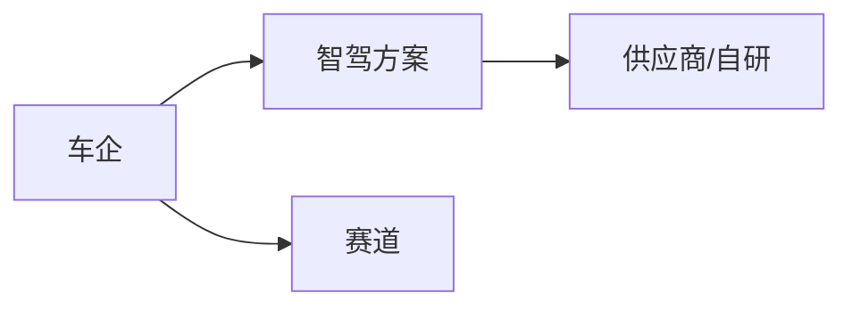
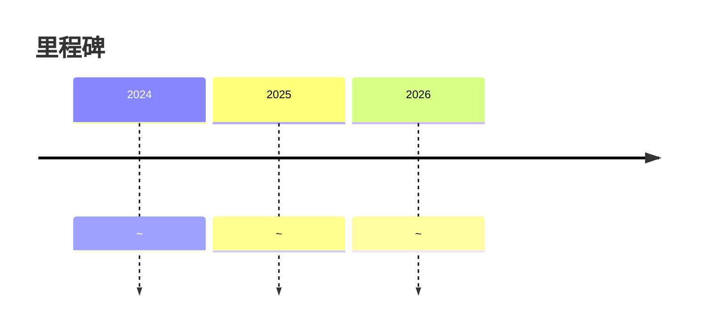

# 名称

<!-- AUTO:START oem-logo -->
<!-- AUTO:END oem-logo -->

## 定位/主营业务

填写车企定位、主要市场、智驾战略和当前商业化阶段。

## 产品矩阵

| 产品/车型 | 定位 | 芯片 | 算力TOPS | 传感器 | 智驾功能 |
| --- | --- | --- | --- | --- | --- |
| ~ | ~ | ~ | ~ | ~ | ~ |

## 合作关系

## 里程碑

## 一句话点评

~
