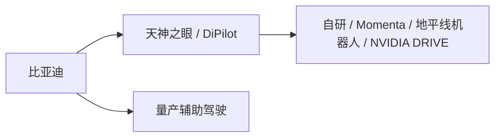
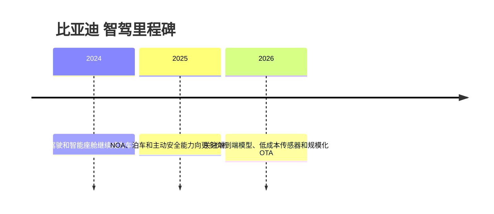

# 比亚迪

<!-- AUTO:START oem-logo -->

<!-- AUTO:END oem-logo -->

## 定位/主营业务

比亚迪 是自动驾驶产业链中的整车平台方，核心观察点是高阶辅助驾驶的前装覆盖、传感器与算力配置、软件订阅/OTA 能力，以及与自研团队或外部供应商的协同。当前页只维护结构化字段中的关系和可核实来源，销量、收入、利润等易变字段保持 `~`。

## 产品矩阵

| 产品/车型 | 定位 | 芯片 | 算力TOPS | 传感器 | 智驾功能 |
| --- | --- | --- | --- | --- | --- |
| 汉 | 代表车型 | ~ | ~ | ~ | ~ |
| 唐 | 代表车型 | ~ | ~ | ~ | ~ |
| 海豹 | 代表车型 | ~ | ~ | ~ | ~ |
| 腾势N7 | 代表车型 | ~ | ~ | ~ | ~ |

## 合作关系

## 里程碑

## 一句话点评

比亚迪的关键变量是把高阶智驾从高端品牌下沉到大规模车型后的体验一致性和成本控制。
