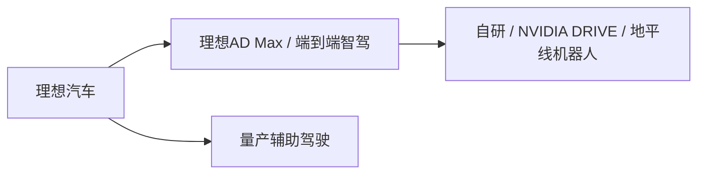
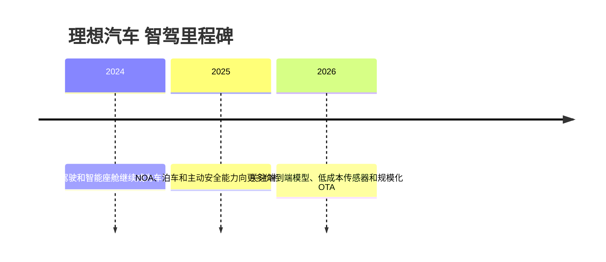

# 理想汽车

<!-- AUTO:START oem-logo -->

<!-- AUTO:END oem-logo -->

## 定位/主营业务

理想汽车 是自动驾驶产业链中的整车平台方，核心观察点是高阶辅助驾驶的前装覆盖、传感器与算力配置、软件订阅/OTA 能力，以及与自研团队或外部供应商的协同。当前页只维护结构化字段中的关系和可核实来源，销量、收入、利润等易变字段保持 `~`。

## 产品矩阵

| 产品/车型 | 定位 | 芯片 | 算力TOPS | 传感器 | 智驾功能 |
| --- | --- | --- | --- | --- | --- |
| L6 | 代表车型 | ~ | ~ | ~ | ~ |
| L7 | 代表车型 | ~ | ~ | ~ | ~ |
| L8 | 代表车型 | ~ | ~ | ~ | ~ |
| MEGA | 代表车型 | ~ | ~ | ~ | ~ |

## 合作关系

## 里程碑

## 一句话点评

理想的核心观察点是家庭车场景中的高速/城区 NOA 体验、座舱交互和端到端模型迭代速度。
