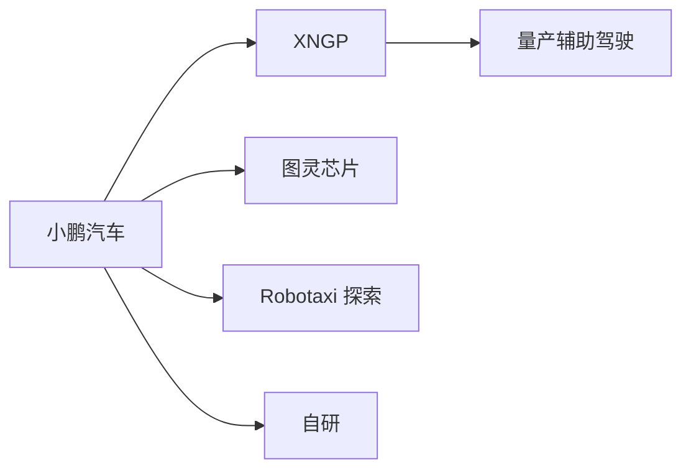
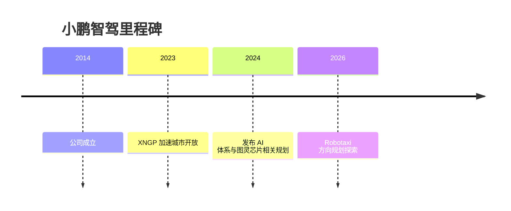

# 小鹏汽车

<!-- AUTO:START oem-logo -->

<!-- AUTO:END oem-logo -->

## 定位/主营业务

小鹏汽车是以智能电动汽车和高阶辅助驾驶为核心标签的新势力车企，智驾路线以自研 XNGP、端到端模型和图灵芯片为主。其自动驾驶布局以量产辅助驾驶为主线，并公开探索面向 2026 年后的 Robotaxi 场景。

## 产品矩阵

| 产品/车型 | 定位 | 芯片 | 算力TOPS | 传感器 | 智驾功能 |
| --- | --- | --- | --- | --- | --- |
| G9 | 中大型 SUV | ~ | ~ | 摄像头/毫米波雷达/激光雷达配置依版本 | XNGP |
| P7 | 轿车 | ~ | ~ | 摄像头/毫米波雷达配置依版本 | 高速/城区辅助驾驶 |
| X9 | MPV | ~ | ~ | 摄像头/毫米波雷达/激光雷达配置依版本 | XNGP |
| MONA M03 | 紧凑型轿车 | ~ | ~ | 摄像头/毫米波雷达配置依版本 | 量产辅助驾驶 |

## 合作关系

## 里程碑

## 一句话点评

小鹏的核心观察点不是单点功能，而是自研芯片、端到端模型和量产车队能否形成稳定的数据飞轮。
