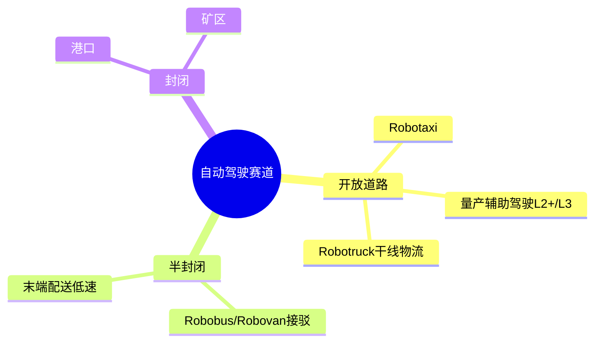
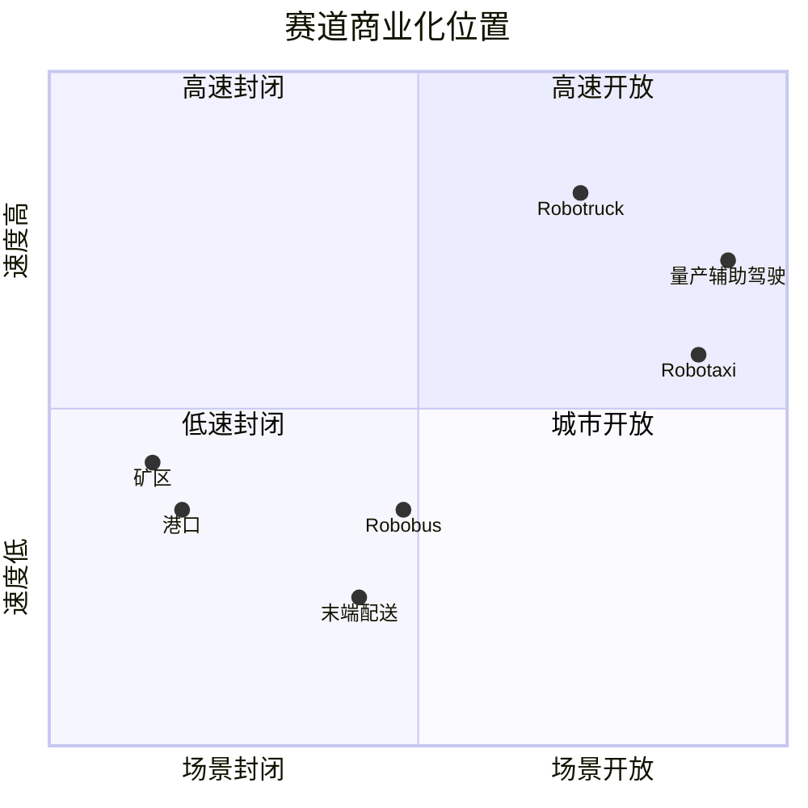

# 赛道

赛道页面定义自动驾驶商业化场景，用于连接车企与自动驾驶公司。分类维度是“运营环境（封闭到开放）× 速度/任务复杂度”。

## 分类图

## 竞争象限

## 赛道索引

`赛博汽车评测角度` 和 `赛博口径评分` 为仓库内部整理：只依据《赛博汽车》账号已公开实测、横评、访谈和商业化观察中出现的体验/安全/运营观察点；不是赛博汽车官方分数。没有找到对应赛博汽车评测依据的赛道用 `~` 标记。

<!-- AUTO:START segments-table -->
| 赛道 | 等级 | 运营环境 | 商业化阶段 | 赛博汽车评测角度 | 赛博口径评分 | 代表玩家 |
| --- | --- | --- | --- | --- | --- | --- |
| [末端配送](last-mile-delivery.md) | L4 | 半封闭 | 早期商业化 | 行人交互安全 / 无图与端到端泛化 / 取货/交接体验 / 全流程自动化 / 远程脱困 / 场景密度 / 路权合规 | 68 | 海外: Nuro / Starship Technologies / Cartken; 中国: 新石器 / 白犀牛 / 京东物流无人车 / 美团无人配送 |
| [矿区](mining.md) | L4 | 封闭 | 规模化 | 重载行驶安全 / 连续作业可靠性 / 调度协同 / 装卸/排土闭环 / 远程监管 / 单吨成本 / 恶劣工况适应 | 86 | 海外: Caterpillar / Komatsu; 中国: 踏歌智行 / 易控智驾 / 伯镭科技 |
| [港口](port.md) | L4 | 封闭 | 规模化 | 港区作业安全 / 调度协同体验 / 装卸/堆场效率 / 远程监管 / 能源补给与运维 / 跨港复制 | 78 | 海外: Einride / Fernride; 中国: 西井科技 / 主线科技 / 斯年智驾 |
| [量产辅助驾驶](production-adas.md) | L2+/L3 | 开放道路 | 规模化 | 跟车控制ACC / 车道保持 / 弯道组合控制 / 紧急避险 / 目标切换识别 / 自动变道/NOA / 驾驶员注意力监测 / 功能成本 | 57 | 海外: Mobileye / Tesla / NVIDIA / Qualcomm; 中国: 华为乾崑智驾 / Momenta / 地平线机器人 / DeepRoute.ai / 大疆车载 / 轻舟智航 |
| [Robobus/Robovan](robobus-robovan.md) | L4 | 半封闭 | 试运营 | 座舱/货舱体验 / 固定线路行驶安全 / 站点停靠与上下客 / 远程监管 / 应急处置 / 数据合规 / 系统集成 | 66 | 海外: May Mobility / EasyMile / Zoox; 中国: 文远知行 / 轻舟智航 / 百度Apollo / 新石器 |
| [Robotaxi](robotaxi.md) | L4 | 开放道路 | 早期商业化 | 叫车与上下车体验 / 座舱/乘坐体验 / 行驶平顺性 / 行驶安全 / 真无人程度 / 异常接管与责任 / 运营边界 | 55 | 海外: Waymo / Zoox / Tesla / Motional / AutoX / Cruise(已退出) / Argo AI(已退出); 中国: 百度Apollo Go / 小马智行 / 文远知行 / 元戎启行 / 轻舟智航 |
| [Robotruck](robotruck.md) | L4 | 开放道路 | 早期商业化 | 重载行驶安全 / 编队/跟车控制 / 门到门无人闭环 / 货运任务完成度 / 远程接管 / 车辆可靠性 / 运力效率 | 72 | 海外: Aurora / Kodiak Robotics / Waabi / PlusAI; 中国: 小马智卡 / 赢彻科技 / 主线科技 / 图森未来(已退出) |
<!-- AUTO:END segments-table -->
